# Práctica 6.1 - Dockerización del despliegue de una aplicación Node.js

## Instalación de Docker Engine y Docker Compose

### Docker Engine

Primero, actualizamos la lista de paquetes:

```bash
sudo apt update
```
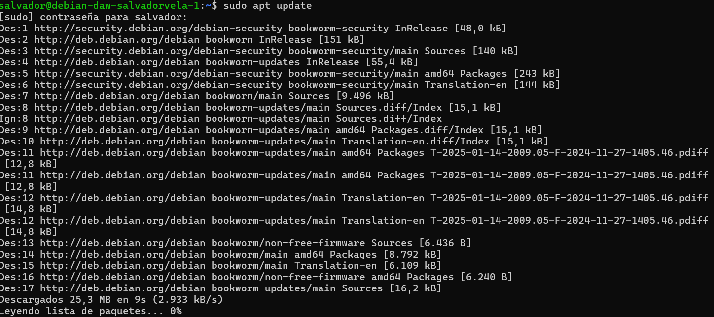

Luego, instalamos los paquetes necesarios para que APT use repositorios a través de HTTPS:

```bash
sudo apt install apt-transport-https ca-certificates curl gnupg lsb-release
```
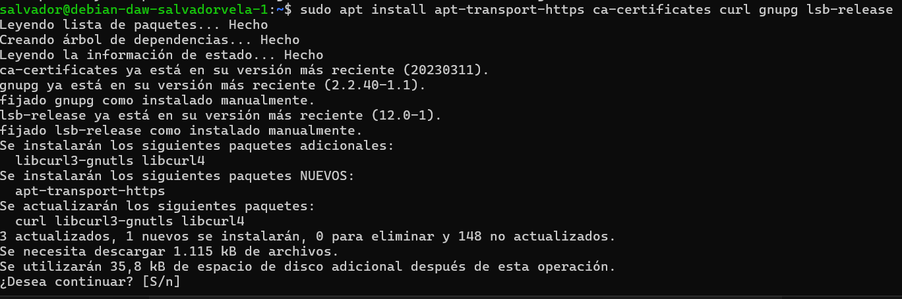

Añadimos la clave GPG oficial de Docker:

```bash 
curl -fsSL https://download.docker.com/linux/debian/gpg | sudo gpg --dearmor -o /usr/share/keyrings/docker-archive-keyring.gpg
```
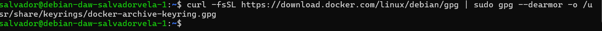

Añadimos el repositorio de Docker a APT:

```bash
echo "deb [arch=$(dpkg --print-architecture) signed-by=/usr/share/keyrings/docker-archive-keyring.gpg] https://download.docker.com/linux/debian $(lsb_release -cs) stable" | sudo tee /etc/apt/sources.list.d/docker.list > /dev/null
```
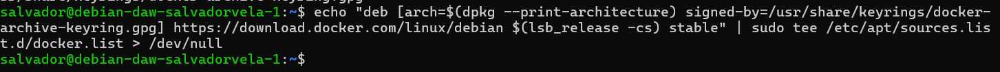

Actualizamos nuevamente la lista de paquetes:

```bash
sudo apt update
```
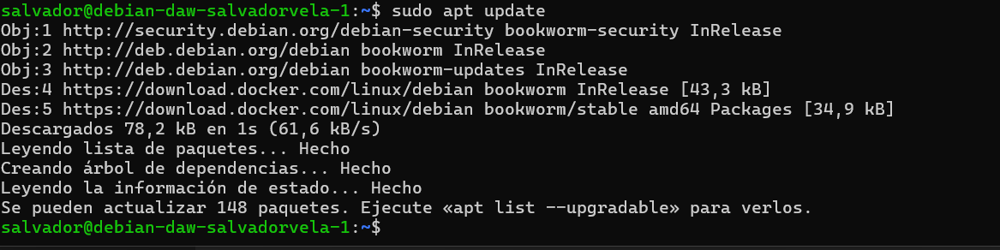

Instalamos Docker Engine:

```bash
sudo apt install docker-ce docker-ce-cli containerd.io
```
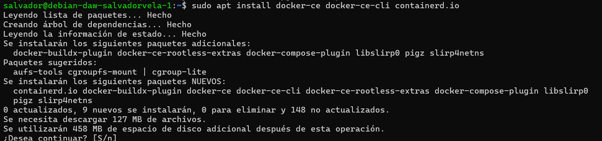

Para verificar si Docker está instalado correctamente, ejecutamos:

```bash
sudo docker run hello-world
```
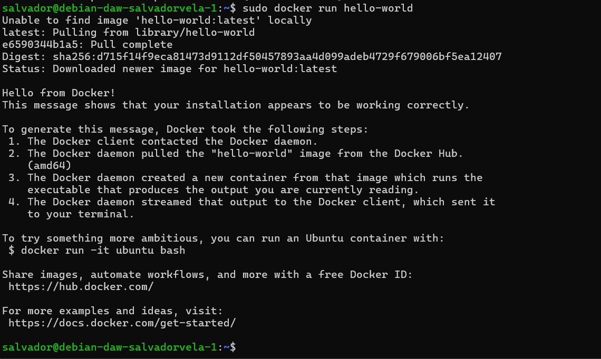

### Docker Compose

Para instalar Docker Compose, descargamos una versión estable (en este caso, la 2.20.2):

```bash
sudo curl -SL https://github.com/docker/compose/releases/download/v2.20.2/docker-compose-linux-$(uname -m) -o /usr/local/bin/docker-compose
```
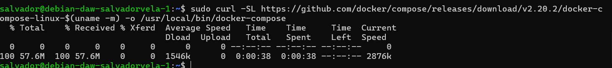

Le damos permisos ejecutables:

```bash
sudo chmod +x /usr/local/bin/docker-compose
```
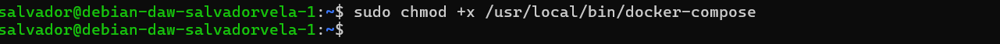

Verificamos si Docker Compose está instalado correctamente:

```bash
docker-compose --version
```
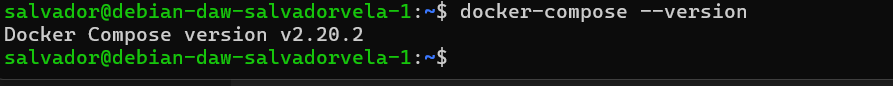

## Despliegue con Docker

En primer lugar, si eliminastéis el repositorio en su momento, debéis volver a clonarlo en vuestra Debian, en caso contrario obviad este paso:

```bash
$ git clone https://github.com/raul-profesor/DAW_practica_6.1_2024.git
```
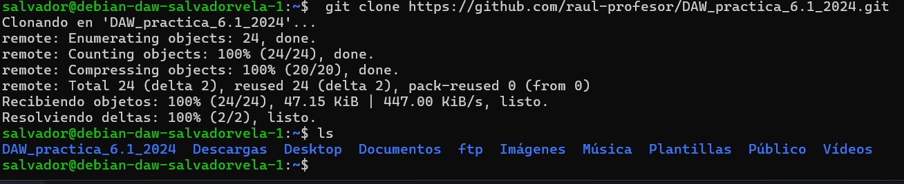

Ahora, puesto que la aplicación ya viene con el Dockerfile necesario dentro del directorio para construir la imagen y correr el contenedor, vamos a estudiar su contenido.

### Tarea

Completa este Dockerfile con las opciones/directivas adecuadas, leed los comentarios y podéis apoyaros en la teoría, en este cheatsheet, en este otro o en cualquiera que encontréis.
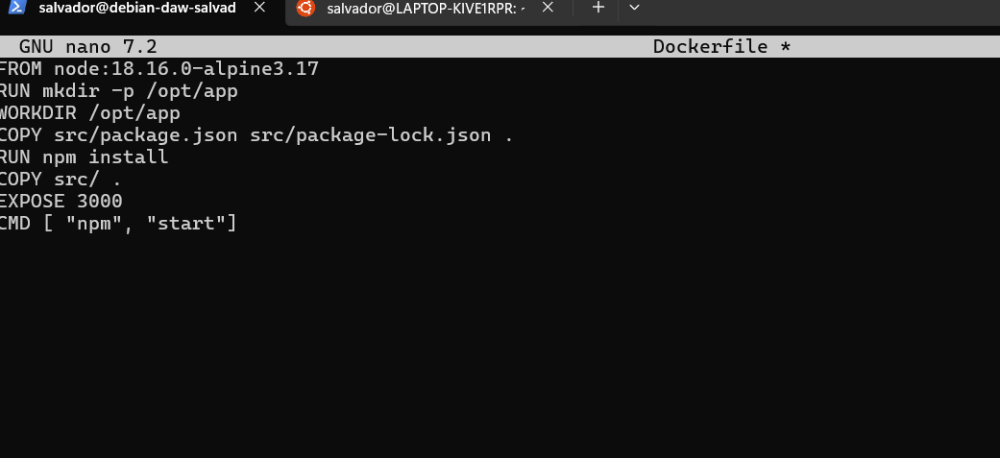

Así pues, tener nuestra aplicación corriendo es cuestión de un par de comandos.

Hacemos un build de la imagen de Docker. Le indicamos que ésta se llama `librodirecciones` y que haga el build con el contexto del directorio actual de trabajo, así como del Dockerfile que hay en él:

```bash
$ docker build -t librodirecciones .
```
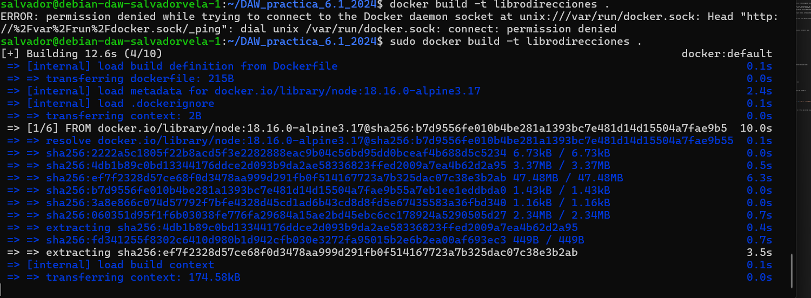

Y por último, iniciamos el contenedor con nuestra aplicación. Ahora sí, con la opción `-p`, le indicamos que escuche conexiones entrantes de cualquier máquina en el puerto 3000 de nuestra máquina anfitrión que haremos coincidir con el puerto 3000 del contenedor (`-p 3000:3000`). Y con la opción `-d` lo haremos correr en modo demonio, en background:

```bash
$ docker run -p 3000:3000 -d librodirecciones
```
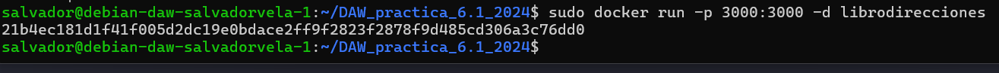

Tras esto sólo queda comprobar que al intentar acceder desde nuestra máquina a la aplicación: `http://IP_Maq_Virtual:3000` se produce un error de conexión.
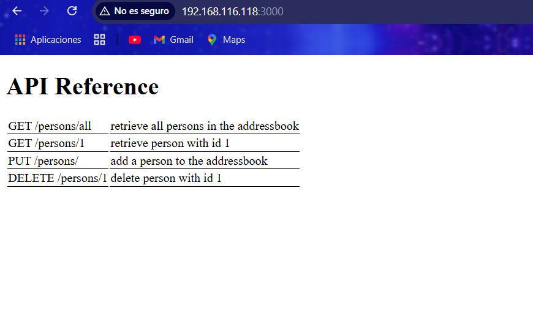

Esto sirve para ilustrar un punto importante de los contenedores: poseen su propia red. La aplicación, por defecto, intenta buscar la base de datos en nuestro localhost pero, técnicamente, está en otro host (su contenedor).

A pesar de que todos los contenedores corren en la misma máquina, cada uno es considerado un host diferente y por eso la aplicación falla al conectar.

Podríamos utilizar los comandos network de Docker para solucionar el asunto. En lugar de eso, introduciremos el concepto de Docker Compose para administrar contenedores.

## Docker Compose

Docker Compose es una herramienta para gestionar aplicaciones multicontenedor. En Linux tiene que ser instalado por separado, consultad su documentación para ello.

Docker Compose puede:

- Iniciar y detener múltiples contenedores en secuencia.
- Conectar contenedores utilizando una red virtual.
- Manejar la persistencia de datos usando Docker Volumes.
- Establecer variables de entorno.
- Construir o descargar imágenes de contenedores según sea necesario.

Docker Compose utiliza un archivo de definición YAML para describir toda la aplicación. En nuestro caso:

```yaml
version: "3.9"
services:
    postgres:
        image: postgres:latest
        environment:
            POSTGRES_USER: postgres
            POSTGRES_PASSWORD: postgres
        ports: 
            - '5432:5432'
        volumes:
            - addressbook-db:/var/lib/postgresql/data

    addressbook:
        build:
            context: .
        environment:
            DB_SCHEMA: postgres
            DB_USER: postgres
            DB_PASSWORD: postgres
            DB_HOST: postgres
        depends_on:
            - postgres
        ports:
            - '3000:3000'

volumes:
    addressbook-db:
```

Así las cosas, para levantar nuestra infraestructura basada en contenedores no tenemos más que hacer:

```bash
$ docker compose run addressbook npm run migrate
```
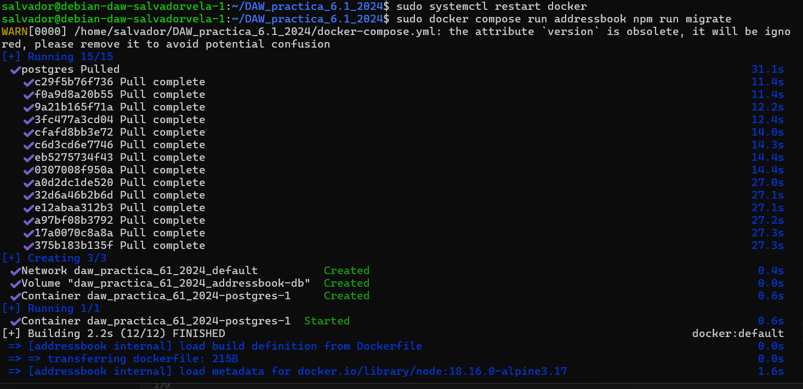
Esto creará las tablas necesarias en la base de datos.

Y construiremos nuestros contenedores a partir de las imágenes:

```bash
$ docker compose up --build -d
```
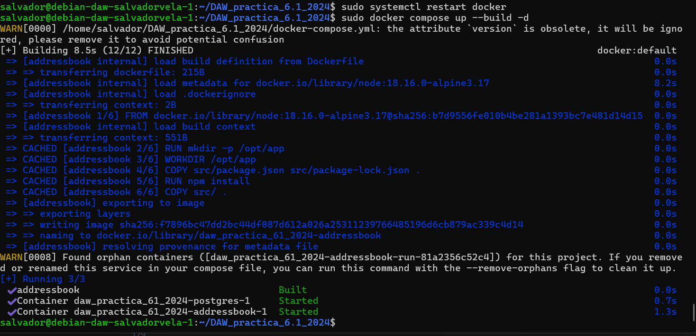
Una vez construidas las imágenes, podemos levantar los contenedores:

Podéis correr unos tests para comprobar que la aplicación funciona correctamente con:

```bash
$ docker compose run addressbook npm test
```
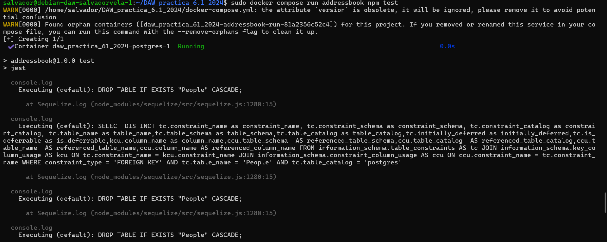

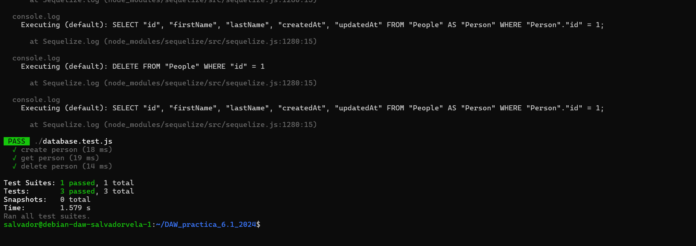
### Tarea

Probad que la aplicación junto con la BBDD funciona correctamente. El funcionamiento de la API es:

- `GET /persons/all` muestra todas las personas en el libro de direcciones
- `GET /persons/1` muestra la persona con el id 1
- `PUT /persons/` añade una persona al libro de direcciones
- `DELETE /persons/1` elimina a la persona con el id 1

Ejemplos:

```bash
curl -X PUT http://IP_APLICACION:3000/persons -H 'Content-Type: application/json' -d '{"id": 1, "firstName": "Raúl", "lastName": "Profesor"}'

curl -X GET http://localhost:3000/persons -H 'Content-Type: application/json'
```
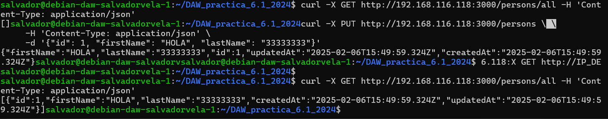
