# Práctica 6.2 - Despliegue de una aplicación PHP con Nginx y MySQL usando Docker y docker-compose

## Instalación de docker-compose

## Proceso de dockerización de Nginx+PHP+MySQL

### 1. Estructura de directorios

La estructura de directorios que debe quedar es esta:

```
/usuario/home/practica6-2/
├── docker-compose.yml
├── nginx
│   ├── default.conf
│   └── Dockerfile
├── php
│   └── Dockerfile
└── www
  └── html
    └── index.php
```

Se pueden ir crrando los directorios y los archivos segun se este haciendo la practica o todo a la vez, con comandos como estos:

```sh
mkdir practica6-2
cd practica6-2
touch docker-compose.yml
mkdir nginx
touch nginx/default.conf
...
```

### 2. Creación de un contenedor Nginx

Para empezar, necesitamos crear y correr un contenedor Nginx que permita alojar nuestra aplicación en PHP.

Dentro de la carpeta `/usuario/home/practica6-2/` debemos haber creado o crear ahora el archivo `docker-compose.yml`.

Y editamos este archivo 

```sh
nano docker-compose.yml
```

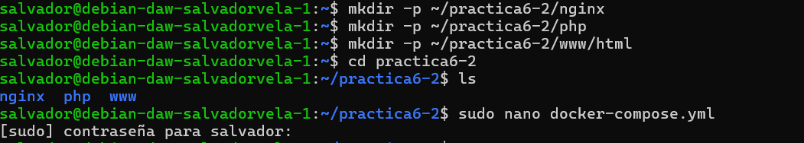

Y añadimos las siguientes líneas:

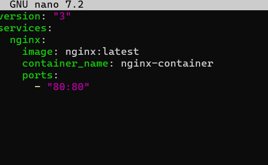

Y lo guardamos.


Despues ejecuutaremos lo siguiente: 

```sh
docker-compose up -d
```

Con la opción `-d`  estamos indicando que el contenedor se ejecute en background o segundo plano.

Para comprobar que el contenedor esta activo usamos lo siguiente:

```sh
docker ps
```


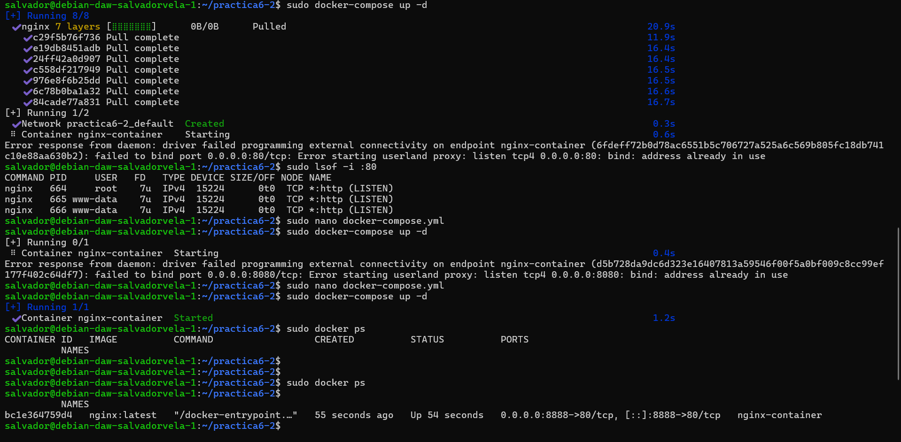

Una vez hecho esto si nos vamos al navegador y ponemos la IP de nuestra maquina virtual y el puerto que hemos configurado (http://IP:PUERTO) nos saldra los siguiente:


### 3. Creación de un contenedor PHP

Creamos la carpeta y el documento dentro de ella, si no se había hecho antes:

```sh
mkdir -p /home/usuario/practica6-2/www/html
nano /home/usuario/practica6-2/www/html/index.php
```

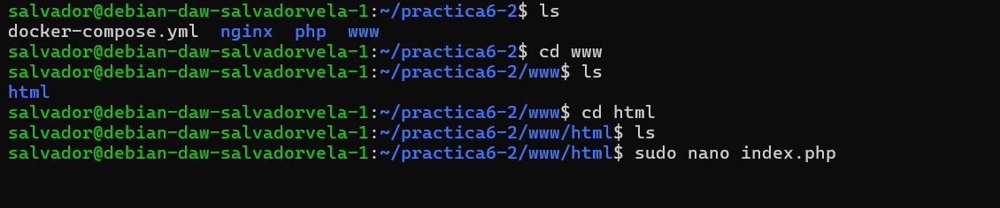

Y dentro de `index.php` añadimos el siguiente código:

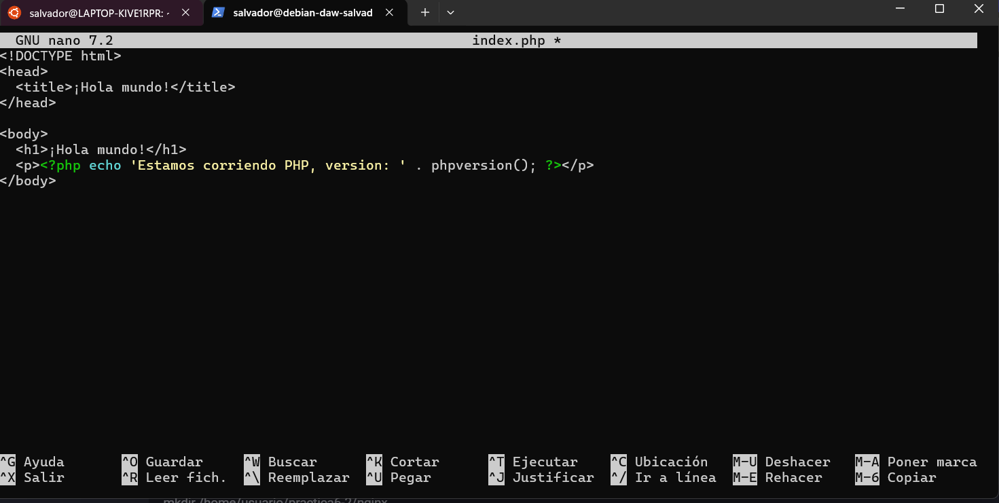

 Se guarda el archivo y crea, si no estaba creado, un directorio llamado `nginx` dentro del directorio del proyecto:

```sh
mkdir /home/usuario/practica6-2/nginx
```

Crearamos el archivo de configuración por defecto para que Nginx pueda correr la aplicación PHP:

```sh
nano /home/usuario/practica6-2/nginx/default.conf
```

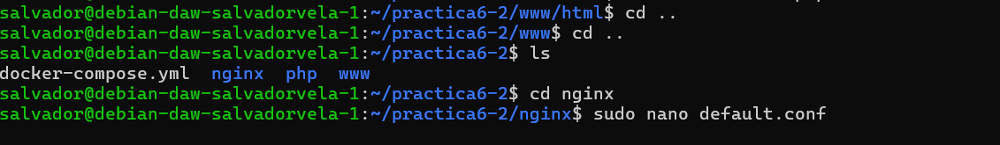

Y dentro de ese archivo, colocaremos la siguiente configuración:

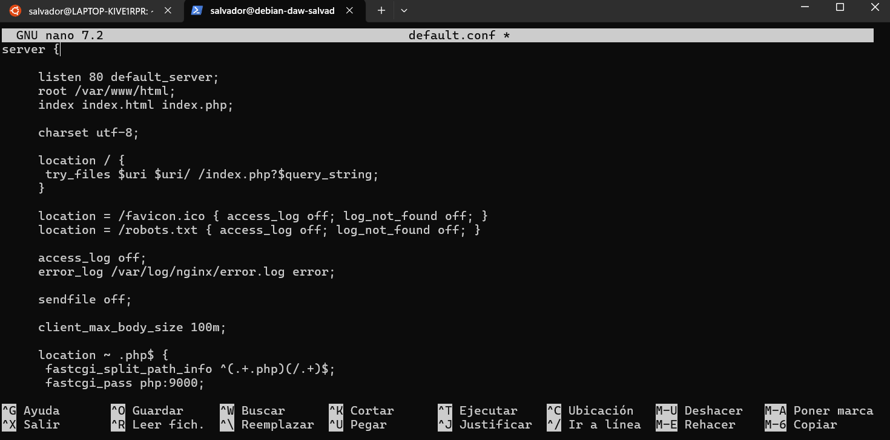

Codigo completo:

```nginx
server {

   listen 80 default_server;
   root /var/www/html;
   index index.html index.php;

   charset utf-8;

   location / {
    try_files $uri $uri/ /index.php?$query_string;
   }

   location = /favicon.ico { access_log off; log_not_found off; }
   location = /robots.txt { access_log off; log_not_found off; }

   access_log off;
   error_log /var/log/nginx/error.log error;

   sendfile off;

   client_max_body_size 100m;

   location ~ .php$ {
    fastcgi_split_path_info ^(.+.php)(/.+)$;
    fastcgi_pass php:9000;
    fastcgi_index index.php;
    include fastcgi_params;
    fastcgi_param SCRIPT_FILENAME $document_root$fastcgi_script_name;
    fastcgi_intercept_errors off;
    fastcgi_buffer_size 16k;
    fastcgi_buffers 4 16k;
  }

   location ~ /.ht {
    deny all;
   }
}
```

Guardamos el archivo y ahora creamos el `Dockerfile` dentro del directorio `nginx`

```sh
nano /home/usuario/practica6-2/nginx/Dockerfile
```


Y dentro de este archivo:

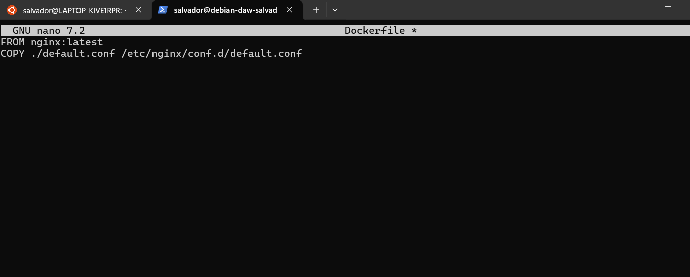

Y ahora editamos nuestro archivo `docker-compose.yml`:

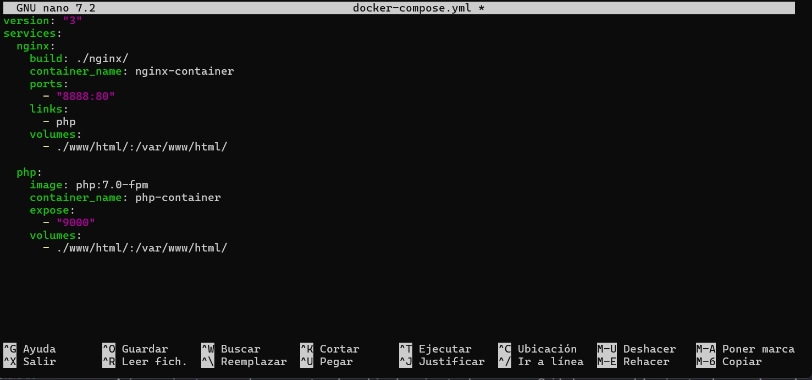


Así pues, ejecutaremos el nuevo contenedor volviendo a ejecutar compose. Se debe ejecutar el comando en el mismo directorio donde tengamos nuestro archivo `docker-compose.yml`:

```sh
cd /home/usuario/practica6-2
docker-compose up -d
```

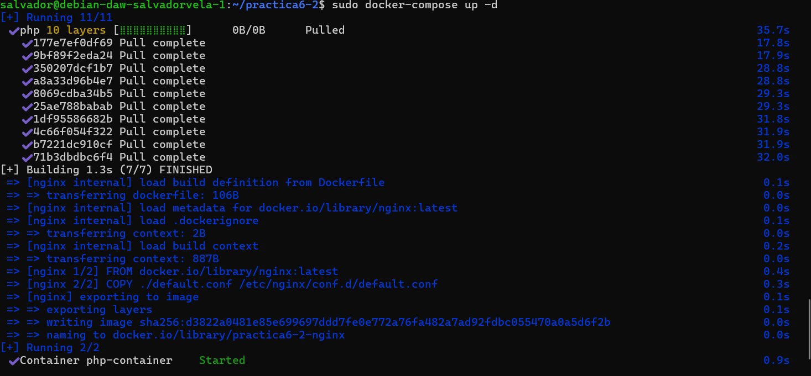

Y comprobamos que los contenedores están corriendo:

```sh
docker ps
```

Se debe de ver algo similar a esto:

```
CONTAINER ID   IMAGE                  COMMAND                  CREATED          STATUS          PORTS                               NAMES
82c8baf15221   docker-project_nginx   "/docker-entrypoint.…"   23 seconds ago   Up 22 seconds   0.0.0.0:80->80/tcp, :::80->80/tcp   nginx-container
10778c6686d8   php:7.0-fpm            "docker-php-entrypoi…"   25 seconds ago   Up 23 seconds   9000/tcp                            php-container
```

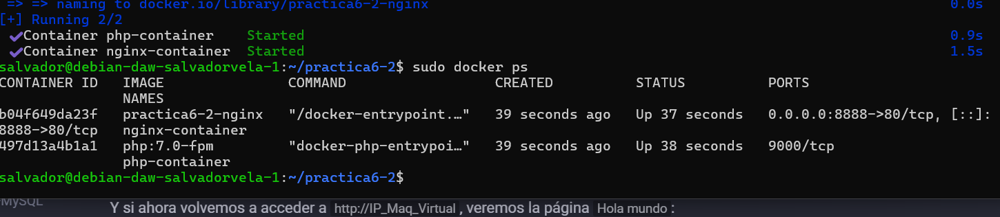

Y si ahora volvemos a acceder a la ip de la maquina virtual desde el navegador, veremos la página Hola mundo.


### 4. Creación de un contenedor para datos

 En este paso crearemos un contenedor independiente que se encargará de contener los datos y lo enlazaremos con el resto de contenedores.

Para hacer esto, volvemos a editar el `docker-compose.yml`:

```sh
nano /usuario/home/practica6-2/docker-compose.yml
```

Y añadiremos un nuevo servicio a los que ya teníamos, quedando así:

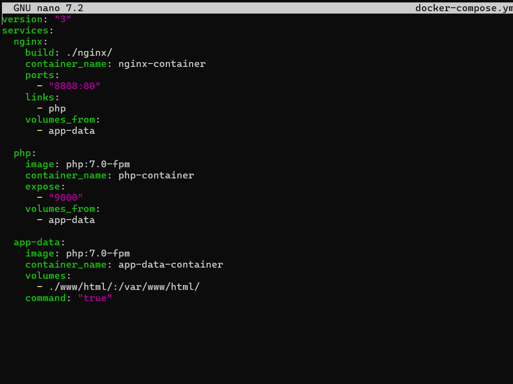

Así que para recrear y lanzar todos los contenedores ejecutamos de nuevo dentro del directorio donde se encuentra el archivo:

```sh
docker-compose up -d
```

Y volvemos a verificar que están corriendo todos:

```sh
docker ps -a
```

Debiendo ver algo como:

```
CONTAINER ID   IMAGE                  COMMAND                  CREATED          STATUS                      PORTS                               NAMES
849315c7ffc0   docker-project_nginx   "/docker-entrypoint.…"   27 seconds ago   Up 25 seconds               0.0.0.0:80->80/tcp, :::80->80/tcp   nginx-container
59a0d7040fd8   php:7.0-fpm            "docker-php-entrypoi…"   28 seconds ago   Up 27 seconds               9000/tcp                            php-container
fbca95944234   php:7.0-fpm            "docker-php-entrypoi…"   29 seconds ago   Exited (0) 28 seconds ago                                       app-data-container
```

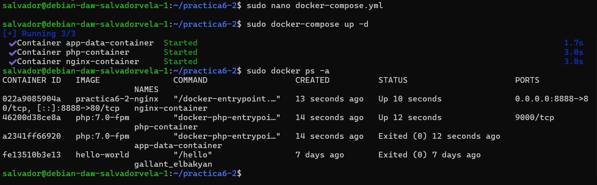

### 5. Creación de un contenedor MySQL

En esta sección crearemos un contenedor de una base de datos MySQL y lo enlazaremos con el resto de contenedores.

Primero, modificaremos la imagen PHP e instalaremos la extensión PHP para MySQL

Creamos, si no lo teníamos ya, nuestro directorio `php` y dentro de él, el archivo `Dockerfile`:

```sh
mkdir /home/usuario/practica6-2/php
nano /home/usuario/practica6-2/php/Dockerfile
```

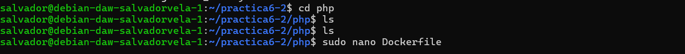

Y dentro del `Dockerfile` ponemos:

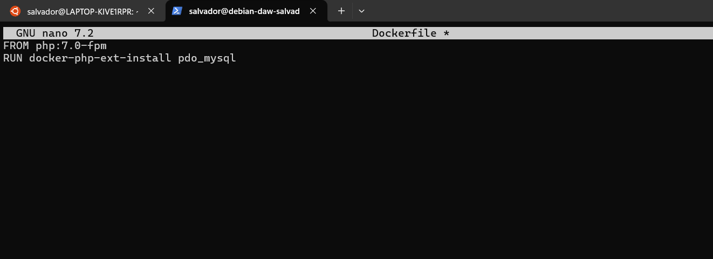

Y una vez más, debemos editar `docker-compose.yml` con el objetivo de que se creen el contenedor para MySQL y el contenedor de los datos de MySQL que contendrá la base de datos y las tablas:

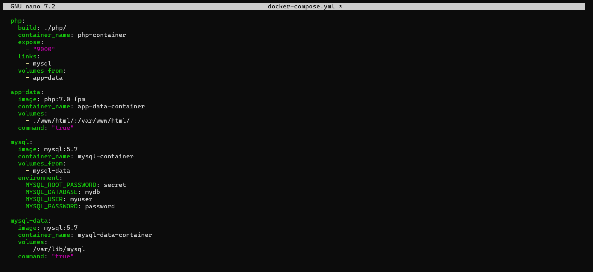

Después de guardar este archivo, editamos el archivo `index.php` y hacemos algunos cambios para comprobar la conexión a la base de datos.

El archivo `index.php` debe quedar así:


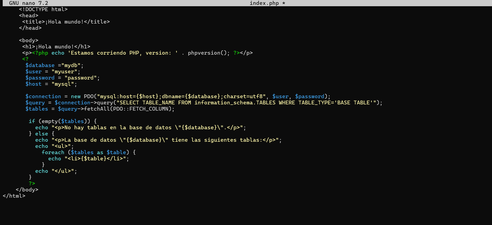


Se Guarda el archivo y se lanzan los contenedores una vez más:

```sh
docker-compose up -d
```

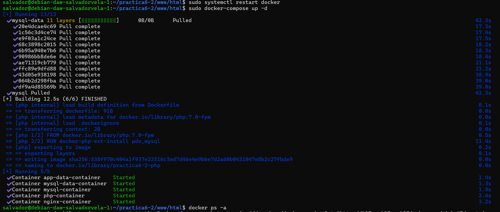

Y verificamos que están ejecutándose:

```sh
docker ps -a
```

Y veremos:

```
CONTAINER ID   IMAGE                  COMMAND                  CREATED          STATUS                      PORTS                               NAMES
d3e82747fe0d   mysql:5.7              "docker-entrypoint.s…"   39 seconds ago   Up 38 seconds               3306/tcp, 33060/tcp                 mysql-container
606320e5a7f8   mysql:5.7              "docker-entrypoint.s…"   41 seconds ago   Exited (0) 39 seconds ago                                       mysql-data-container
ca4f63797d11   docker-project_php     "docker-php-entrypoi…"   2 hours ago      Up 2 hours                  9000/tcp                            php-container
849315c7ffc0   docker-project_nginx   "/docker-entrypoint.…"   2 hours ago      Up 2 hours                  0.0.0.0:80->80/tcp, :::80->80/tcp   nginx-container
fbca95944234   php:7.0-fpm            "docker-php-entrypoi…"   2 hours ago      Exited (0) 39 seconds ago                                       app-data-container
```

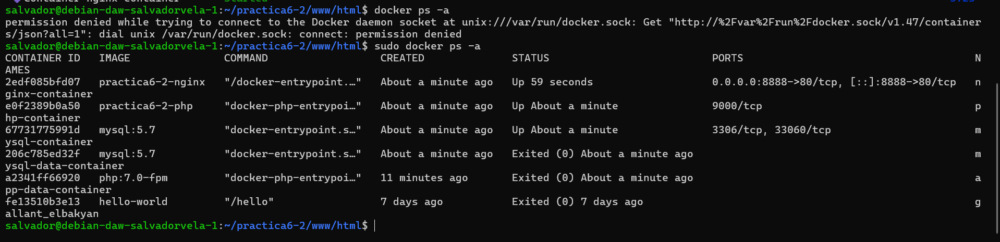

### 6. Verificación de conexión a la base de datos

Si ahora accedemos a la ip de la maquina virtual desde el navegador como hemos hecho antes, deberíamos obtener la siguiente pantalla:

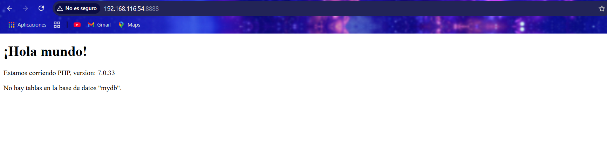

nos dice que no tenemos ninguna tabla en la base de datos `mydb`.

Eso es debido a que tenemos que cambiar la variable $root y la variable $password del index.php

Es decir:

```sh
nano /home/usuario/www/html/index.php
```

Y cambiar las líneas:

```php
$user = "root";
$password = "secret";
```

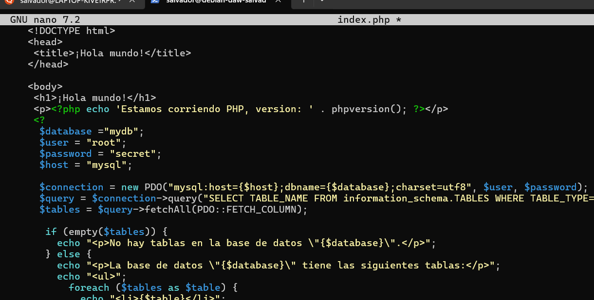

Una vez hecho esto nos dara este resultado:

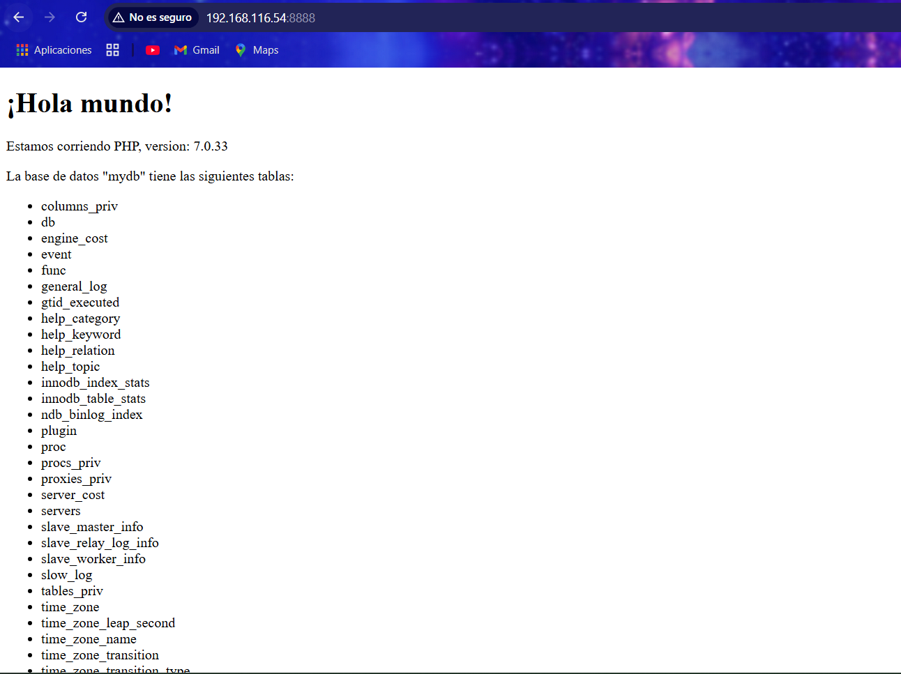