# Despliegue con Docker de NGINX + demonio de autenticación LDAP + OpenLDAP

Para esta práctica nos crearemos un directorio que contendrá nuestro `index.html` con el siguiente texto:

```bash
$ mkdir app

$ cat << EOF > app/index.html
<html>
<body>
<h1>¡Hola Mundo!</h1>
</body>
</html>
EOF
```

Así como otro directorio, con el contenido de la configuración pertinente de Nginx:

```bash
$ mkdir conf

$ cat << EOF > conf/ldap_nginx.conf
  server {
    listen 8080;

    location = / {
     auth_request /auth-proxy;
    }

    location = /auth-proxy {
     internal;

     proxy_pass http://nginx-ldap:8888;

     # URL y puerto para conectarse al servidor LDAP
     proxy_set_header X-Ldap-URL "ldap://openldap:1389";

     # Base DN
     proxy_set_header X-Ldap-BaseDN "dc=example,dc=org";

     # Bind DN
     proxy_set_header X-Ldap-BindDN "cn=admin,dc=example,dc=org";

     # Bind password
     proxy_set_header X-Ldap-BindPass "adminpassword";
    }
   }
EOF
```

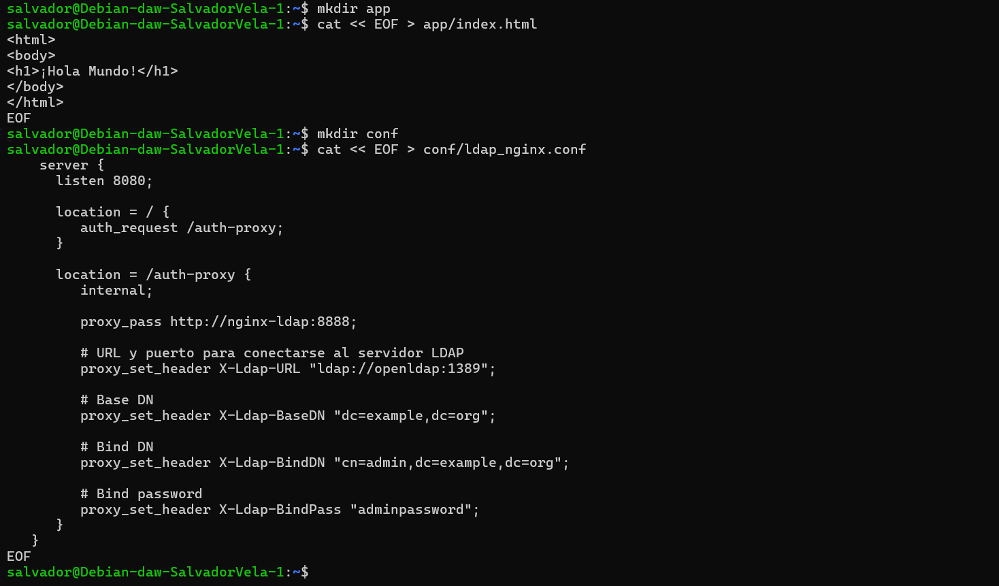


Y ahora, procedemos con el siguiente `docker-compose.yml`:

```yaml
version: '2'

services:
  nginx-ldap:
  image: bitnami/nginx-ldap-auth-daemon-archived
  ports:
    - 8888:8888
  nginx:
  image: bitnami/nginx
  ports: 
   - 8080:8080
  volumes:
   - ./app:/app
   - ./conf/ldap_nginx.conf:/opt/bitnami/nginx/conf/server_blocks/ldap_nginx.conf
  openldap:
  image: bitnami/openldap
  ports:
    - '1389:1389'    
  environment:
    - LDAP_ADMIN_USERNAME=admin
    - LDAP_ADMIN_PASSWORD=adminpassword
    - LDAP_USERS=customuser
    - LDAP_PASSWORDS=custompassword
```

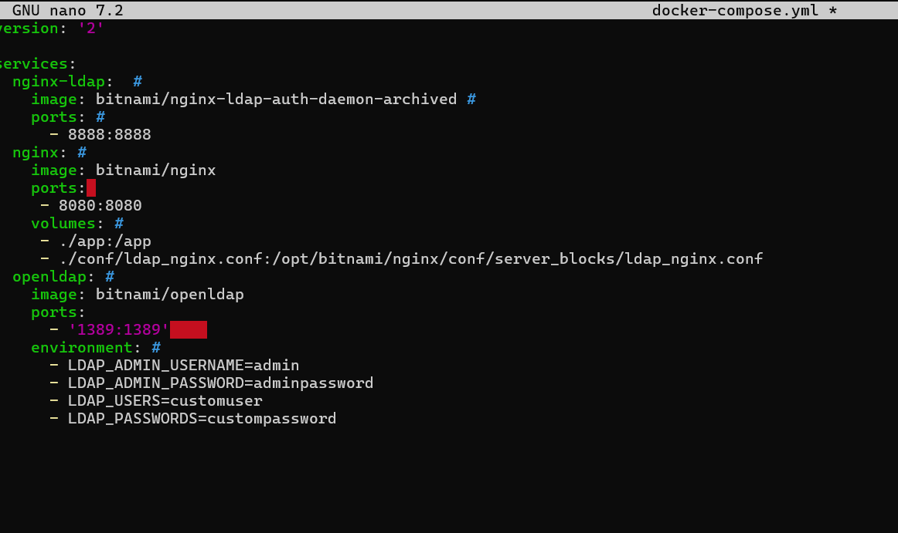

Tras esto sólo queda ejecutar compose:

```bash
docker-compose up
```

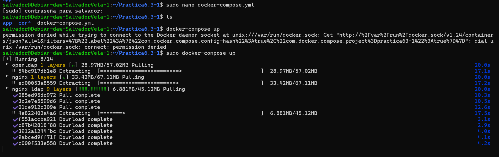

### Tarea

Comprobar que puedes acceder a `http://IP_Maq_Virtual:8080` y loguearte en el servidor LDAP que acabas de desplegar.

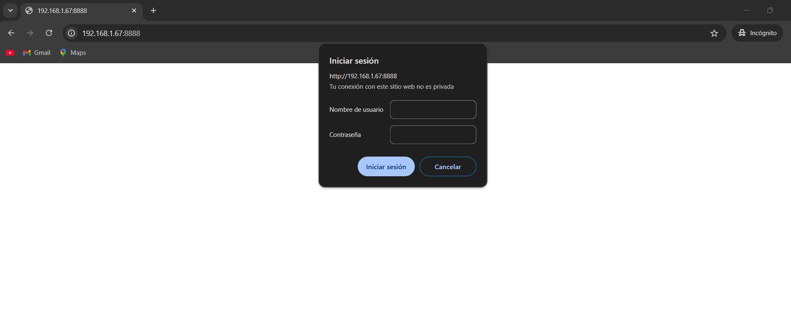

# Despliegue con Docker de PHP + Apache con autenticación LDAP

Creamos un directorio que se llame `Practica6.3`.

En primer lugar, como es obvio, dentro del directorio creado debemos crear el `index.php` de nuestra aplicación:

```php
<?php
echo 'Ey, hola usuario autenticado por LDAP!';
```

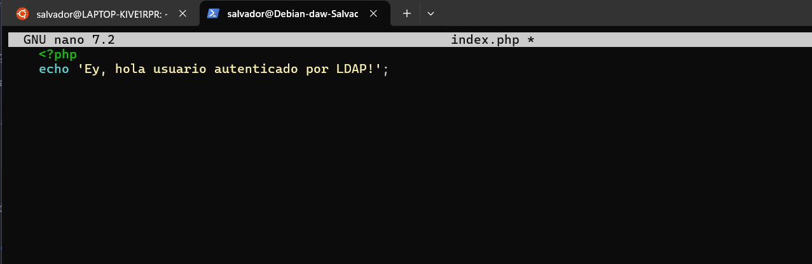

Dentro de nuestro directorio de trabajo, creado anteriormente, crearemos otro directorio llamado `Docker` y dentro de él, un `Dockerfile` (`./Docker/Dockerfile`).

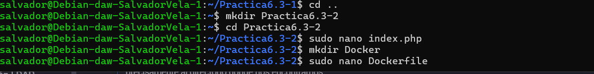


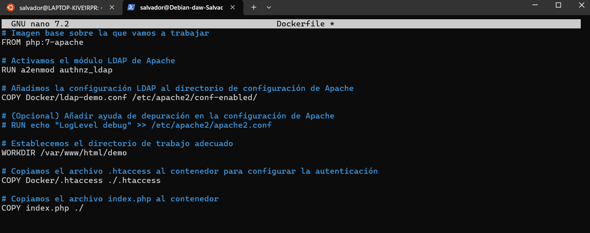

Ahora crearemos el archivo `./Docker/ldap-demo.conf`, que es la configuración LDAP. Aquí establecemos los criterios de conexión con el contenedor de OpenLDAP, password y URL.


```conf
# ./Docker/ldap-demo.conf
PassEnv LDAP_BIND_ON
PassEnv LDAP_PASSWORD
PassEnv LDAP_URL
<AuthnProviderAlias ldap demo>
  AuthLDAPBindDN ${LDAP_BIND_ON}
  AuthLDAPBindPassword ${LDAP_PASSWORD}
  AuthLDAPURL ${LDAP_URL}
</AuthnProviderAlias>
```

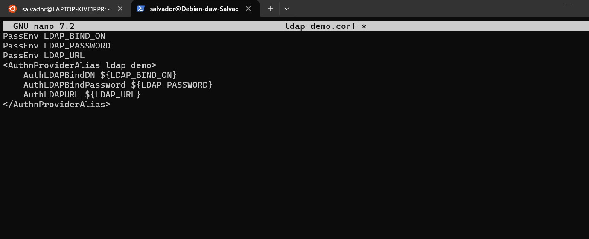

Creamos el archivo `.htaccess`:

```conf
# .Docker/.htaccess
AuthBasicProvider demo
AuthType Basic
AuthName "Protected Area"
Require valid-user
```

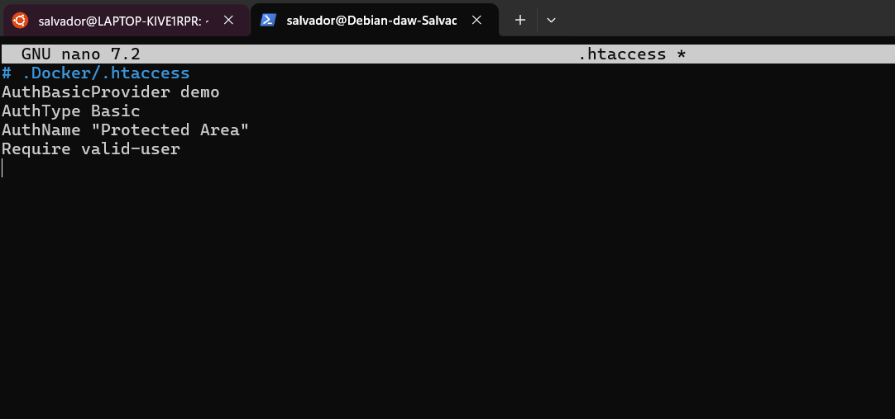

Dentro de nuestro directorio de trabajo, construimos la imagen con el siguiente comando:

```bash
docker build . \
  -t docker-ldap \
  -f ./Docker/dockerfile
```

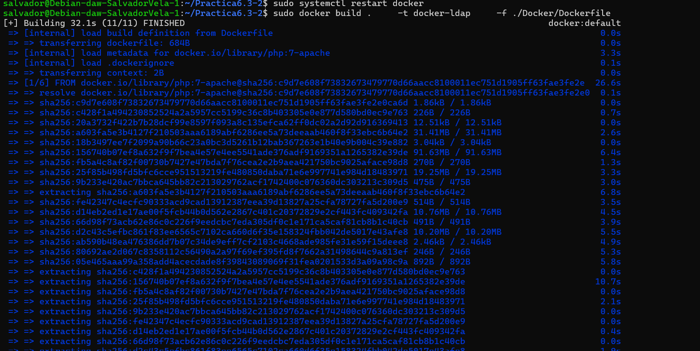

Corremos el contenedor indicando las credenciales de nuestra cuenta LDAP mediante variables de entorno con la flag `-e`. Para este caso, vamos a probar un servidor LDAP externo.

Utilizaremos un servidor público en Internet dedicado a pruebas: [https://www.freeipa.org/page/Demo](https://www.freeipa.org/page/Demo). 

```bash
docker run -d \
  -p 3000:80 \
  --name ldap_demo \
  -e LDAP_BIND_ON='uid=admin,cn=users,cn=accounts,dc=demo1,dc=freeipa,dc=org' \
  -e LDAP_PASSWORD='Secret123' \
  -e LDAP_URL='LDAP://ipa.demo1.freeipa.org' \
  docker-ldap
```
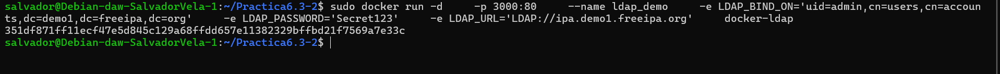

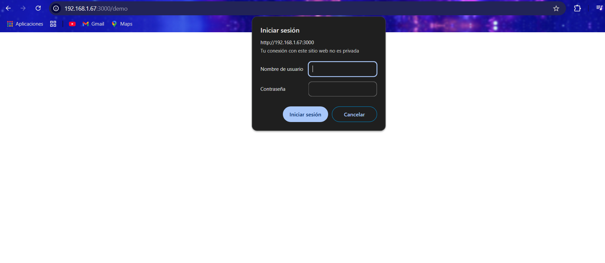
