# PRACTICA 2.2 

## Paquetes necesarios

Para esta práctica podemos utilizar la herramienta openssl para crear las contraseñas.

En primer lugar debemos comprobar si el paquete está instalado:
```bash
dpkg -l | grep openssl

```


Y si no lo estuviera, instalarlo con el siguiente comando:

```bash
sudo apt update sudo apt install openssl
```

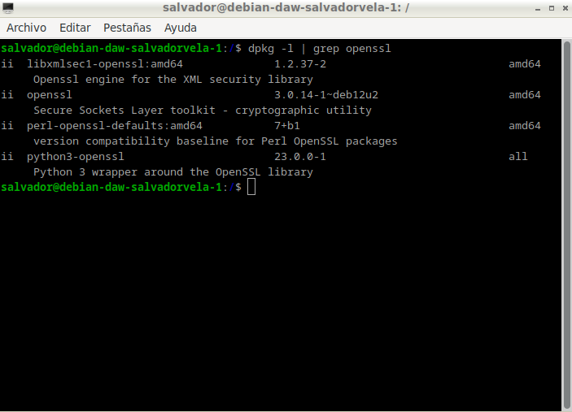

## Creación de usuarios y contraseñas para el acceso web

Crearemos un archivo oculto llamado “.htpasswd” en el directorio de configuración `/etc/nginx` donde guardar nuestros usuarios y contraseñas (la `-c` es para crear el archivo):

```bash
sudo sh -c "echo -n 'vuestro_nombre:' >> /etc/nginx/.htpasswd"
```


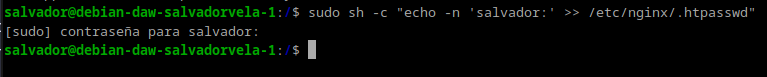

Ahora crearemos un password cifrado para el usuario:

```bash
sudo sh -c "openssl passwd -apr1 >> /etc/nginx/.htpasswd"
```


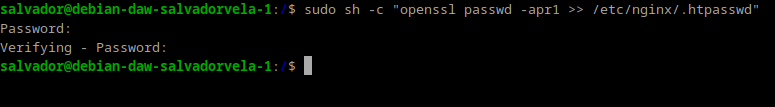

Este proceso se podrá repetir para tantos usuarios como haga falta.

Crea dos usuarios, uno con tu nombre y otro con tu primer apellido.  
Comprueba que el usuario y la contraseña aparecen cifrados en el fichero:

`cat /etc/nginx/.htpasswd`


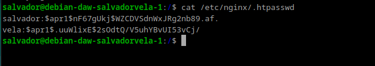

## Configurando el servidor Nginx para usar autenticación básica

Editaremos la configuración del **server block** sobre el cual queremos aplicar la restricción de acceso. Utilizaremos para esta autenticación el sitio web de la práctica anterior:


`sudo nano /etc/nginx/sites-available/nombre_web`

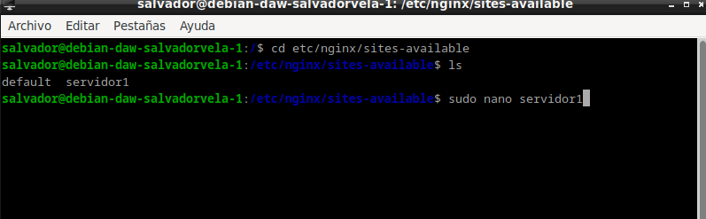

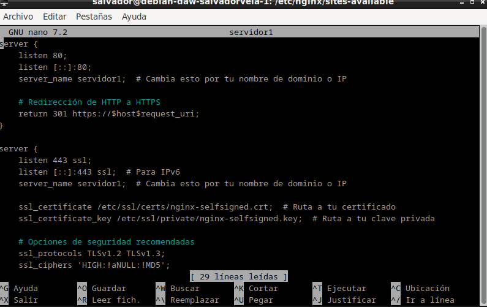

Debemos decidir qué recursos estarán protegidos. Nginx permite añadir restricciones a nivel de servidor o en un `location` (directorio o archivo) específico. Para nuestro ejemplo, vamos a proteger el **document root** (la raíz, la página principal) de nuestro sitio.

Utilizaremos la directiva `auth_basic` dentro del `location` y le pondremos el nombre a nuestro dominio que será mostrado al usuario al solicitar las credenciales. Por último, configuramos Nginx para que utilice el fichero que previamente hemos creado con la directiva `auth_basic_user_file`:

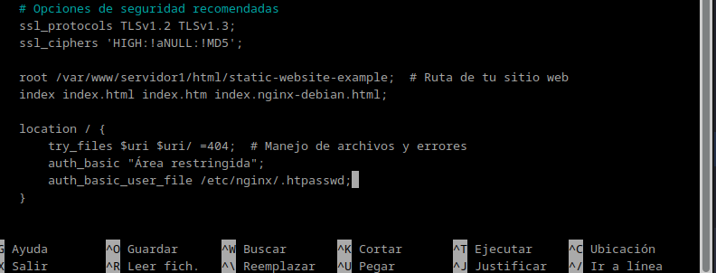

Una vez terminada la configuración, reiniciamos el servicio para que aplique nuestra política de acceso:

`sudo systemctl restart nginx`


## PROBANDO LA NUEVA CONFIGURACION

### Comprobación 1

Comprueba desde tu máquina física/anfitrión que puedes acceder a `http://nombre-sitio-web` y que se te solicita autenticación.

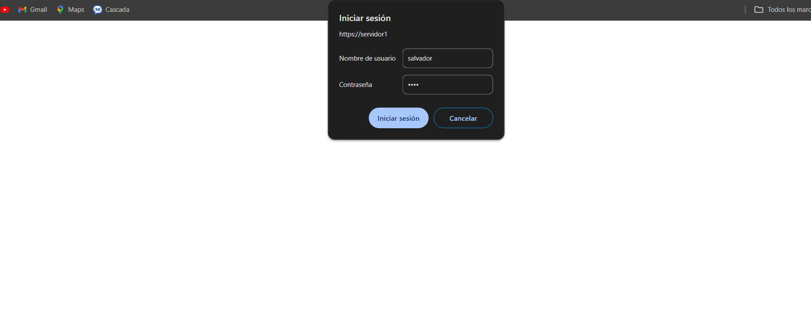

### Comprobación 2

Comprueba que si decides cancelar la autenticación, se te negará el acceso al sitio con un error. ¿Qué error es?

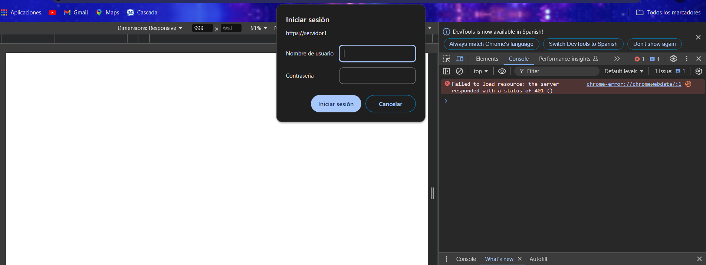

### Registro del log de error 

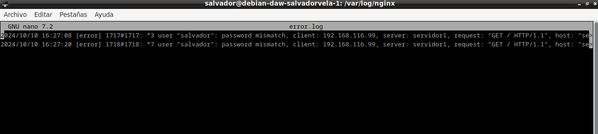

Cuando hemos configurado el siguiente bloque:

```bash
location / { auth_basic "Área restringida"; auth_basic_user_file /etc/nginx/.htpasswd; try_files $uri $uri/ =404; }
```

La autenticación se aplica al directorio/archivo que le indicamos en la declaración del `location` y que en este caso es la raíz `/`.

Así pues, esta restricción se aplica al directorio raíz o base donde residen los archivos del sitio web, que es:

`/var/www/webraul/html/simple-static-website`

Y a todos los archivos que hay dentro, ya que no hemos especificado ninguno en concreto.

## Combinación de la autenticación básica con la restricción de acceso por IP

La autenticación básica HTTP puede ser combinada de forma efectiva con la restricción de acceso por dirección IP. Se pueden implementar dos escenarios:

- Un usuario debe cumplir ambas cosas: estar autenticado y tener una IP válida.
- Un usuario debe, o bien estar autenticado, o bien tener una IP válida.

Veamos cómo lo haríamos:

### Cómo permitir o denegar acceso sobre una IP concreta (directivas `allow` y `deny`, respectivamente).

Dentro del **server block** o archivo de configuración del dominio web, que recordad está en el directorio `sites-available`:

El acceso se garantizará a la IP `192.168.1.1/24`, excluyendo a la dirección `192.168.1.2`.

Hay que tener en cuenta que las directivas `allow` y `deny` se irán aplicando en el orden en el que aparecen en el archivo.

Aquí aplican sobre la `location /api` (esto es sólo un ejemplo de un hipotético directorio o archivo), pero podrían aplicar sobre cualquiera, incluida todo el sitio web, la `location` raíz `/`.

La última directiva `deny all` quiere decir que, por defecto, denegaremos el acceso a todo el mundo. Por eso hay que poner los `allow` y `deny` más específicos justo antes de esta, porque al evaluarse en orden de aparición, si los pusiéramos debajo se denegaría el acceso a todo el mundo, puesto que `deny all` sería lo primero que se evaluaría.

### Combinar la restricción IP y la autenticación HTTP con la directiva `satisfy`.

Si establecemos el valor de la directiva a `all`, el acceso se permite si el cliente satisface ambas condiciones (IP y usuario válido). Si lo establecemos a `any`, el acceso se permite si se satisface al menos una de las dos condiciones.

## Tareas

### Tarea 1

Configura Nginx para que no deje acceder con la IP de la máquina anfitriona al directorio raíz de una de tus dos webs. Modifica su **server block** o archivo de configuración. Comprueba cómo se deniega el acceso:

Para hacer esto nos deberemos ir al archivo `etc/nginx/sites-available/servidor1` y añadir la siguiente línea en `location /`:

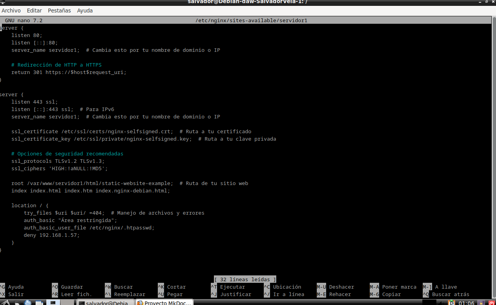

Una vez terminado reiniciamos el servidor nginx con el comando:

`sudo systemctl restart nginx`

Muestra la página de error en el navegador.


Muestra el mensaje de error de `error.log`.

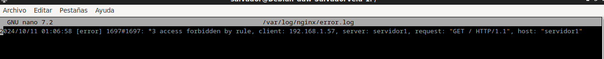

### Tarea 2

Configura Nginx para que desde tu máquina anfitriona se tenga que tener tanto una IP válida como un usuario válido, ambas cosas a la vez, y comprueba que sí puedes acceder sin problemas.

Para hacer esto se debe de tener un usuario web con su contraseña ya definido. Como ya lo tenemos, solo tenemos que poner esto en el archivo `etc/nginx/sites-available/servidor1`:

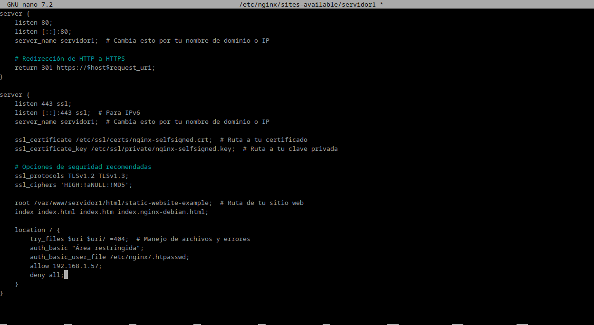

y reiniciar el servidor con:

`sudo systemctl restart nginx`

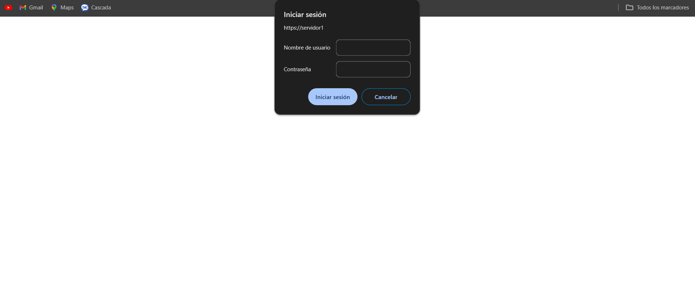

L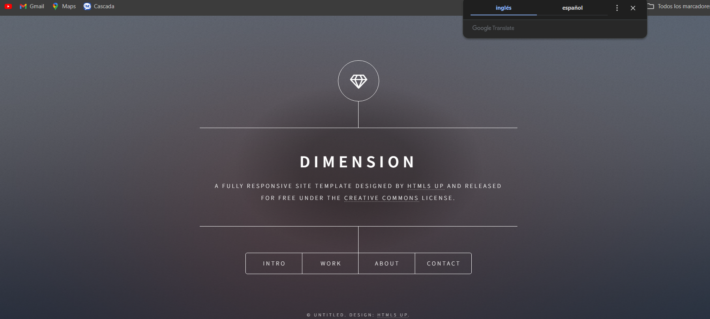

Y este es el registro de `access.log`:

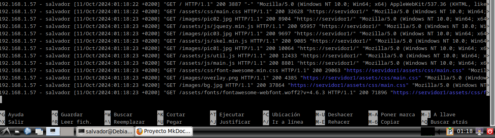

## Cuestiones finales

### Cuestión 1

Supongamos que yo soy el cliente con la IP `172.1.10.15` e intento acceder al directorio `web_muy_guay` de mi sitio web, equivocándome al poner el usuario y contraseña. ¿Podré acceder? ¿Por qué?

```bash
location /web_muy_guay { satisfy all;
deny 172.1.10.6; allow 172.1.10.15; allow 172.1.3.14; deny all; auth_basic "Cuestión final 1"; auth_basic_user_file conf/htpasswd; }
```


### Solución

Debido a que la directiva `satisfy all` exige que ambas condiciones (IP válida y autenticación básica correcta) se cumplan para permitir el acceso, no podrás acceder al directorio si te equivocas en la autenticación básica, incluso si tu IP es permitida.

### Cuestión 2

Supongamos que yo soy el cliente con la IP `172.1.10.15` e intento acceder al directorio `web_muy_guay` de mi sitio web, introduciendo correctamente usuario y contraseña. ¿Podré acceder? ¿Por qué?

```bash
location /web_muy_guay { satisfy all;
deny all; deny 172.1.10.6; allow 172.1.10.15; allow 172.1.3.14; auth_basic "Cuestión final 2: The revenge"; auth_basic_user_file conf/htpasswd; }
```

### Solución

Debido a que la directiva `satisfy all` exige que ambas condiciones (IP válida y autenticación básica correcta) se cumplan para permitir el acceso, ya que has ingresado bien el usuario y la contraseña y la IP está permitida, se podrá acceder sin problemas.

### Cuestión 3

Supongamos que yo soy el cliente con lP 172.1.10.15 e intento acceder al directorio `web_muy_guay` de mi sitio web, introduciendo correctamente usuario y contraseña. ¿Podré acceder?¿Por qué?
```bash
    location /web_muy_guay {
    #...
    satisfy any;    
    deny  172.1.10.6;
    deny 172.1.10.15;
    allow 172.1.3.14;

    auth_basic "Cuestión final 3: The final combat";
    auth_basic_user_file conf/htpasswd;
}
```
### Solucion

No podrás acceder al directorio web_muy_guay porque, aunque la autenticación es correcta, la IP 172.1.10.15 está explícitamente denegada.


###  Cuestión 4

A lo mejor no sabéis que tengo una web para documentar todas mis excursiones espaciales con Jeff, es esta: Jeff Bezos y yo

Supongamos que quiero restringir el acceso al directorio de proyectos porque es muy secreto, eso quiere decir añadir autenticación básica a la URL:Proyectos

Completa la configuración para conseguirlo:
```bash
    server {
        listen 80;
        listen [::]:80;
        root /var/www/freewebsitetemplates.com/preview/space-science;
        index index.html index.htm index.nginx-debian.html;
        server_name freewebsitetemplates.com www.freewebsitetemplates.com;
        location              {

            try_files $uri $uri/ =404;
        }
    }
```

### Solucion 

La configuracion actualizada sería :
```bash
server {
    listen 80;
    listen [::]:80;

    root /var/www/freewebsitetemplates.com/preview/space-science;
    index index.html index.htm index.nginx-debian.html;

    server_name freewebsitetemplates.com www.freewebsitetemplates.com;

    
    location / {
        try_files $uri $uri/ =404;
    }


    location /Proyectos {
        auth_basic "Acceso restringido a Proyectos";  
        auth_basic_user_file /etc/nginx/.htpasswd;  

        try_files $uri $uri/ =404;  
    }
}
```