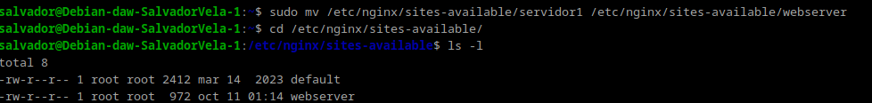
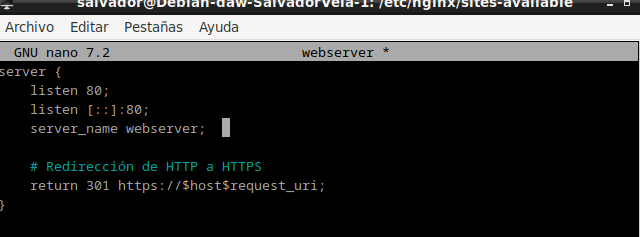
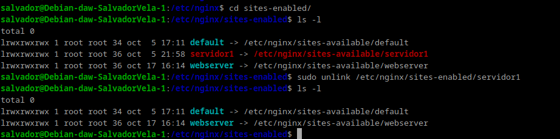
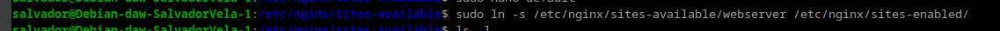
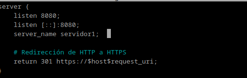
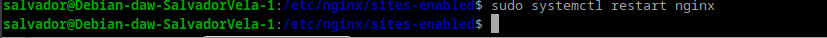
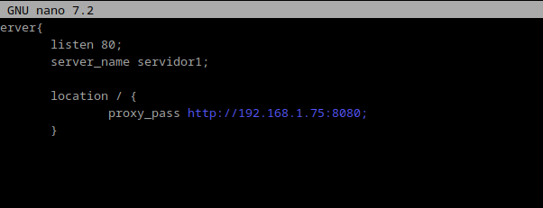
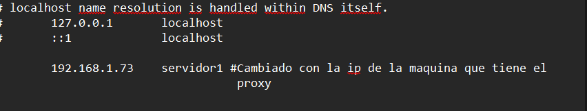
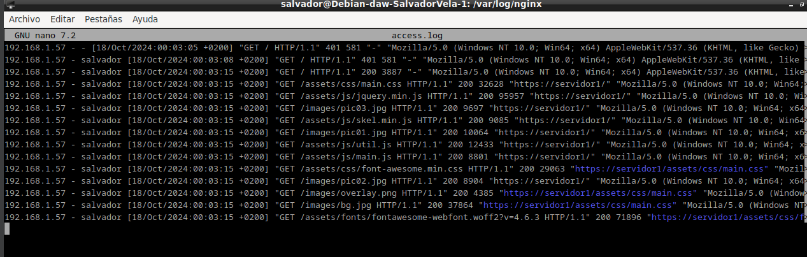
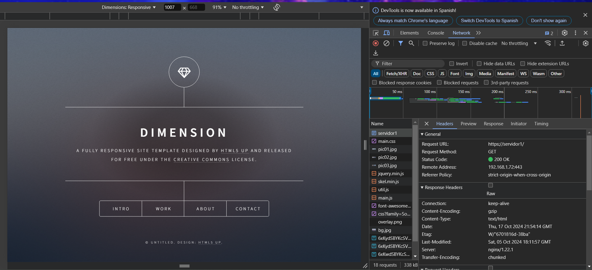

# PRACTICA 3.3 
Vamos a configurar dos Debian con sendos servidores Nginx. Tenéis la máquina virtual inicial y debéis clonarla para tener una segunda:

Uno servirá las páginas web que ya hemos configurado, así pues utilizaremos el servidor que ya tenemos configurado de la Práctica 2.1.

El nuevo servidor clon Debian con Nginx configurado como proxy inverso.

Realizaremos las peticiones HTTP desde el navegador web de nuestra máquina física/anfitrión hacia el proxy clonado, que nos redirigirá al servidor web original.

Cuidado.

En primer lugar, debéis cambiar el nombre que tuviera vuestra web por el de webserver, ello implica:

Cambiar el nombre del archivo de configuración de sitios disponibles para Nginx.



Cambiar el nombre del sitio web dentro de este archivo de configuración donde haga falta.



No os olvidéis de eliminar el link simbólico antiguo con el comando `unlink nombre_del_link` dentro de la carpeta `sites-enabled` y crear el nuevo para el nuevo nombre de archivo.





En el archivo de configuración del sitio web, en lugar de hacer que el servidor escuche en el puerto 80, cambiadlo al 8080.



Reiniciar Nginx.



Ahora, cuando intentamos acceder a `http://ejemplo-proxy` (o el nombre que tuvieráis de vuestra web de las prácticas anteriores), en realidad estaremos accediendo al proxy, que nos redirigirá a `http://webserver:8080`, el servidor web que acabamos de configurar para que escuche con ese nombre en el puerto 8080.

Para ello:

Crear un archivo de configuración en `sites-available` con el nombre `ejemplo-proxy` (o el que tuvieráis vosotros).

Este archivo de configuración será más simple, tendrá la siguiente forma:

```nginx
server { 
    listen __; 
    server_name ____________; 
    location / { 
        proxy_pass http://_________:____; 
    } 
}
```

Donde, mirando el diagrama de red y teniendo en cuenta la configuración hecha hasta ahora, debéis completar:

- El puerto donde está escuchando el proxy inverso.
- El nombre de vuestro dominio o sitio web original al que accedemos en el proxy.
- La directiva `proxy_pass` indica a dónde se van a redirigir las peticiones, esto es, al servidor web. Por tanto, debéis poner la IP y número de puerto adecuados de vuestro sitio web configurado en el apartado anterior.



Crear el link simbólico pertinente.


Esto es para simular la situación en la que nosotros, como clientes, cuando accedamos a nuestro sitio web, no necesitemos saber cómo está todo configurado, sólo necesitamos saber el nombre de la web.

Debéis modificar el archivo `host` que configurastéis en la práctica 2.1. Si miráis el diagrama de red, ahora el nombre de vuestro sitio web se corresponderá con la IP de la nueva máquina clon que hace de proxy. Será ésta la encargada de redirigirnos automáticamente al verdadero sitio web.



### Comprobaciones

Si accedéis a vuestro sitio web, debéis poder seguir accediendo sin problemas.

Comprobad en los `access.log` de los dos servidores que llega la petición.



Comprobad además la petición y respuesta con las herramientas de desarrollador de Firefox en Xubuntu. Pulsando `F12` en el navegador os aparecerán estas herramientas.


