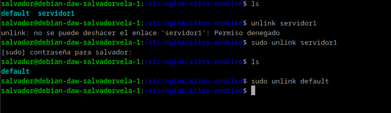
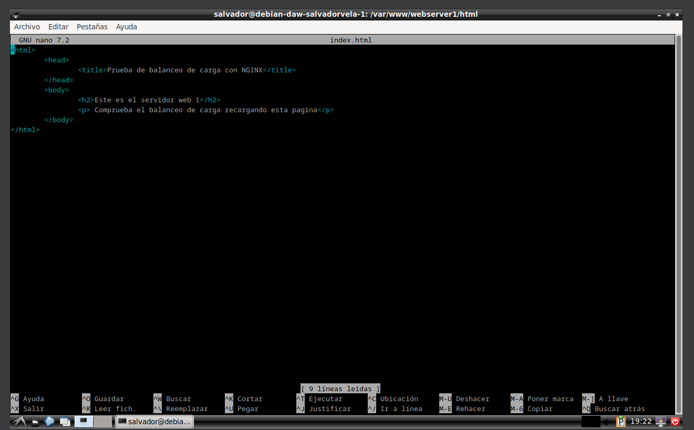
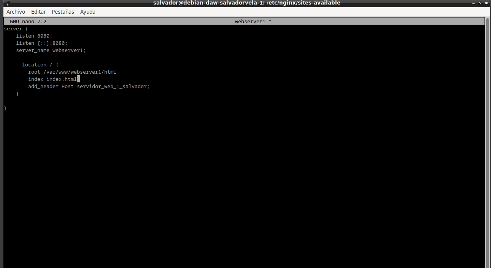
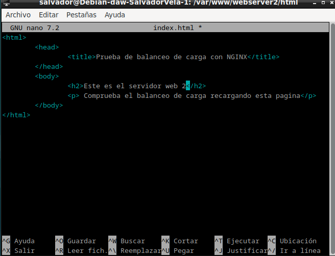
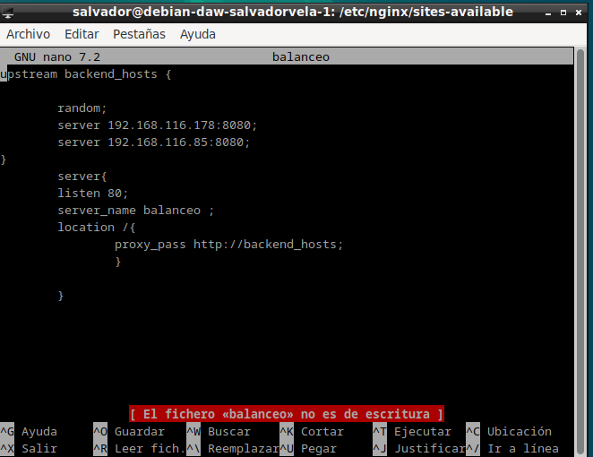
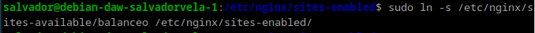
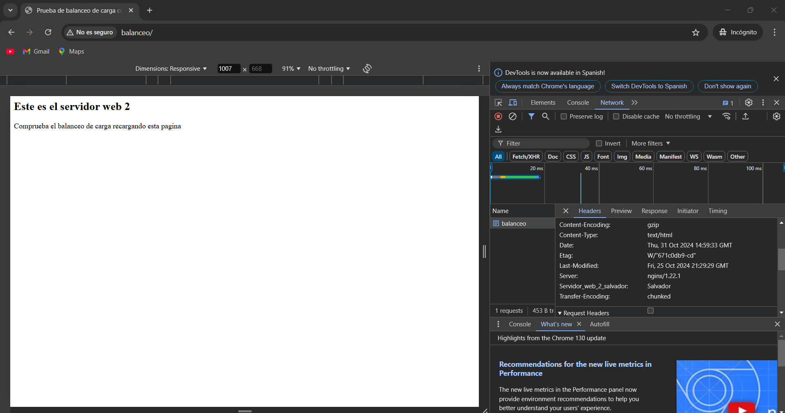
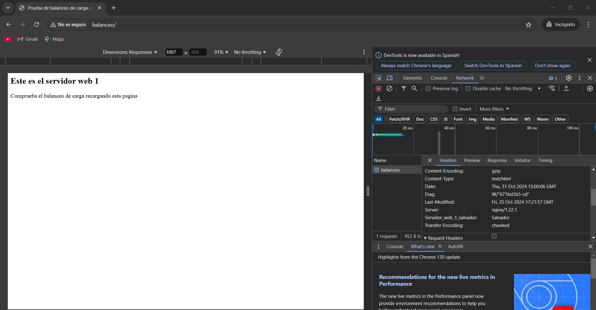

# PRACTICA 2.4 
# Atención

Ya no vamos a utilizar los sitios web que hemos configurado en las prácticas anteriores. Por ello, para evitarnos una serie de problemas que pueden surgir, vamos a desactivarlos.

Dentro de la carpeta `/etc/nginx/sites-enabled` debemos ejecutar `unlink nombre_archivo` para cada uno de los archivos de los sitios web que tenemos.



Si no hacéis esto obtendréis errores en todas las prácticas que quedan de este tema.

## Nginx Servidor Web 1

El primer servidor web será el servidor principal que hemos venido utilizando hasta ahora durante el curso, el original, donde tenemos instalado ya el servicio Web.

Debemos configurar este servidor web para que sirva el siguiente `index.html` que debéis crear dentro de la carpeta `/var/www/webserver1/html`:



El nombre del sitio web que debéis utilizar en los archivos correspondientes (`sites-available…`) que debéis crear para Nginx es `webserver1`, así como en sus configuraciones. Fijáos en las configuraciones que hicisteis en prácticas anteriores a modo de referencia.

El sitio web debe escuchar en el puerto `8080`.

Debéis añadir una cabecera que se llame `Serv_Web1_vuestronombre`.



## Nginx Servidor Web 2

Debe ser una máquina Debian, clon del servidor web 1.

En este servidor web debemos realizar una configuración idéntica al servidor web 1 pero cambiando `webserver1` por `webserver2` (también en el `index.html`), así como el nombre de la cabecera añadida, que será `Serv_Web2_vuestronombre`.



## Warning

Es importante que no quede ninguna referencia a `webserver1` por ningún archivo, de otra forma os dará resultados erróneos y os dificultará mucho encontrar el error.

## Nginx Proxy Inverso

Ya disponemos de los dos servidores web entre los que se van a repartir las peticiones que realice el cliente desde el navegador.

Vamos, por tanto, a configurar el proxy inverso para que realice este reparto de peticiones:

En `sites-available` debéis crear el archivo de configuración con el nombre `balanceo`.

Este archivo tendrá el siguiente formato:

```nginx
upstream backend_hosts {
    random;
    server ________:____;
    server ________:____;
}
server {
    listen 80;
    server_name ________;
    location / {
        proxy_pass http://backend_hosts;
    }
}
```

Donde:
El bloque upstream → son los servidores entre los que se va a repartir la carga, que son los dos que hemos configurado anteriormente.

Si miráis el diagrama y tenéis en cuenta la configuración que habéis hecho hasta ahora, aquí deberéis colocar la IP de cada servidor, así como el puerto donde está escuchando las peticiones web.

A este grupo de servidores le ponemos un nombre, que es `backend_hosts`.





### Aclaración

En un sitio web, el backend se encarga de todos los procesos necesarios para que la web funcione de forma correcta. Estos procesos o funciones no son visibles pero tienen mucha importancia en el buen funcionamiento de un sitio web.

El parámetro `random` lo que hace es repartir las peticiones HTTP que llegan al proxy inverso de forma completamente aleatoria entre el grupo de servidores que se haya definido en el bloque `upstream` (en nuestro caso sólo hay dos).

Pondremos `random` porque es lo más fácil para comprobar que todo funciona bien en la práctica, pero hay diferentes formas de repartir la carga (las peticiones HTTP).

### Comprobaciones

Si accedéis a vuestro sitio web, debéis poder seguir accediendo sin problemas.

Comprobad dándole repetidamente a F5, que accedéis cada vez a uno de los servidores. Se os mostrará el contenido del `index.html` del servidor correspondiente cada vez.

Para una doble comprobación, utilizando las herramientas de desarrollador, mostrad que la web que se os muestra coincide con la cabecera que ha añadido el servidor web en la respuesta HTTP.





### Comprobación del balanceo de carga cuando cae un servidor

Nuestro balanceador de carga está constantemente monitorizando “la salud” de los servidores web. De esta forma, si uno deja de funcionar por cualquier razón, siempre enviará las solicitudes a los que queden “vivos”. Vamos a comprobarlo:

Para el servicio Nginx en el servidor web 1 y comprueba, de la misma forma que en el apartado anterior, que todas las solicitudes se envían ahora al servidor web 2.

Tras iniciar de nuevo Nginx en el servidor web 1, repite el proceso con el servidor web 2.
