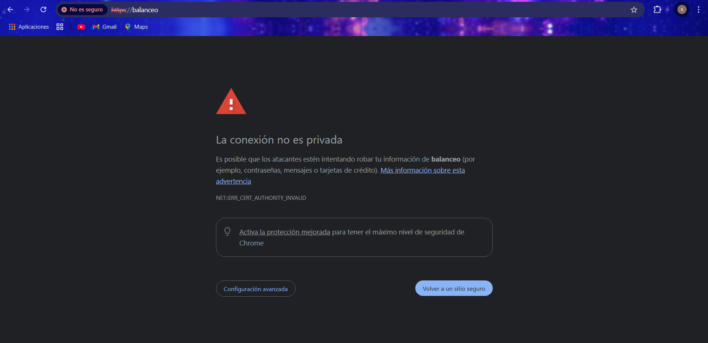

# Practica 2.5

## Creación de certificado autofirmado

Nosotros no utilizaremos certificados de ninguna CA de confianza, básicamente porque:

- Nuestros servicios no están publicados en Internet
- Estos certificados son de pago

Así pues, nosotros crearemos nuestros propios certificados y los firmaremos nosotros mismos como si fuéramos una CA auténtica para poder simular este escenario.


Veamos pues el proceso para generar los certificados y las claves asociadas a ellos (privada/pública). En primer lugar debemos crear el siguiente directorio:

```bash
/etc/nginx/ssl
```


Podemos crear el certificado y las claves de forma simultánea con un único comando, donde:

- `openssl`: esta es la herramienta por línea de comandos básica para crear y administrar certificados, claves y otros archivos OpenSSL.
- `req`: este subcomando se utiliza para generar una solicitud de certificados y también solicitudes de firma de certificados (CSR).

- `-x509`: Esto modifica aún más el subcomando anterior al decirle a la herramienta que queremos crear un certificado autofirmado en lugar de generar una solicitud de firma de certificado, como sucedería normalmente.
- `-nodes`: Esto le dice a OpenSSL que omita la opción de asegurar nuestro certificado con contraseña. Necesitamos que Nginx pueda leer el archivo sin la intervención del usuario cuando se inicia el servidor. Una contraseña evitaría que esto sucediera ya que tendríamos que introducirla a mano después de cada reinicio.
- `-days 365`: esta opción establece el tiempo durante el cual el certificado se considerará válido. Lo configuramos para un año.
- `-newkey rsa:2048`: Esto especifica que queremos generar un nuevo certificado y una nueva clave al mismo tiempo. No creamos la clave necesaria para firmar el certificado en un paso anterior, por lo que debemos crearla junto con el certificado. La `rsa:2048` parte le dice que cree una clave RSA de 2048 bits de longitud.
- `-keyout`: este parámetro le dice a OpenSSL dónde colocar el archivo de clave privada generado que estamos creando.
- `-out`: Esto le dice a OpenSSL dónde colocar el certificado que estamos creando.

El comando completo sería así:

```bash
openssl req -x509 -nodes -days 365 -newkey rsa:2048 -keyout /etc/nginx/ssl/nginx.key -out /etc/nginx/ssl/nginx.crt
```


Os solicitará que introduzcáis una serie de parámetros, como véis en el recuadro rojo de abajo de la imagen. Debéis introducir los mismos parámetros que en la imagen excepto en el “Organizational Unit Name” que véis recuadrado en amarillo. Ahí deberéis poner `2DAW – DEAW - Vuestronombre`.

## Configuración SSL en el proxy inverso

De la práctica anterior, dentro del directorio `/etc/nginx/sites-available` ya debéis tener el archivo de configuración llamado `balanceo`. Es precisamente aquí donde realizaremos la configuración para que el acceso al sitio web se realice mediante SSL (HTTPS).

Dentro del bloque `server {…}` debéis cambiar el puerto de escucha (`listen 80`) por lo que véis en la imagen de abajo, añadiendo las siguientes líneas de configuración también, de tal forma que quede:

```nginx
server {
    listen 443 ssl;
    ssl_certificate /etc/nginx/ssl/nginx.crt;
    ssl_certificate_key /etc/nginx/ssl/nginx.key;
    ssl_protocols TLSv1.2 TLSv1.3;
    ssl_ciphers HIGH:!aNULL:!MD5;
    server_name balanceo;
    access_log /var/log/nginx/https_access.log;
}
```

Donde le estáis diciendo que:

- Escuche en el puerto 443 → Puerto por defecto de HTTPS
- El directorio donde está el certificado que habéis generado anteriormente
- El directorio donde está la clave que habéis generado anteriormente
- Los protocolos y tipos de cifrados que se pueden utilizar → Estas son las versiones de protocolos y los tipos de cifrados considerados seguros a día de hoy (hay muchos más pero no se consideran seguros actualmente)
- `server_name` ya lo teníais de la práctica anterior, no hace falta tocarlo
- El archivo donde se guardan los logs cambia de nombre, ahora será `https_access.log`


Recordad que tras modificar cualquier configuración de un servicio, hay que reiniciar el servicio, en este caso Nginx.


## Comprobaciones

Si accedéis ahora a `https://balanceo` os debería saltar un aviso de seguridad debido a que nuestro certificado es autofirmado, como comentábamos anteriormente.




## Redirección forzosa a HTTPS

Para que, indistintamente de la forma por la que accedamos al sitio web `balanceo`, siempre se fuerce a utilizar HTTPS, necesitaremos una configuración adicional.

Necesitamos añadir un bloque `server` adicional y separado del otro, al archivo de configuración de `balanceo`. Algo así:

```nginx
server {
    listen 80;
    server_name balanceo;
    access_log /var/log/nginx/http_access.log;
    return 301 https://$host$request_uri;
}
```

Con esta configuración le estamos diciendo que:

- Escuche en el puerto 80 (HTTP).
- Que el nombre al que responderá el servidor/sitio web es `balanceo`.
- Que guarde los logs de este bloque en ese directorio y con ese nombre.
- Cuando se recibe una petición con las dos condiciones anteriores, se devuelve un código **HTTP 301**:

**HTTP 301 Moved Permanently** (Movido permanentemente en español) es un código de estado de HTTP que indica que el host ha sido capaz de comunicarse con el servidor, pero que el recurso solicitado ha sido movido a otra dirección permanentemente. 

Es muy importante configurar las redirecciones 301 en los sitios web, y para ello hay diferentes métodos y sintaxis para realizar la redirección 301.

La redirección 301 es un código o comando insertado por un webmaster que permite redirigir a los usuarios y buscadores de un sitio web de una dirección a otra.

