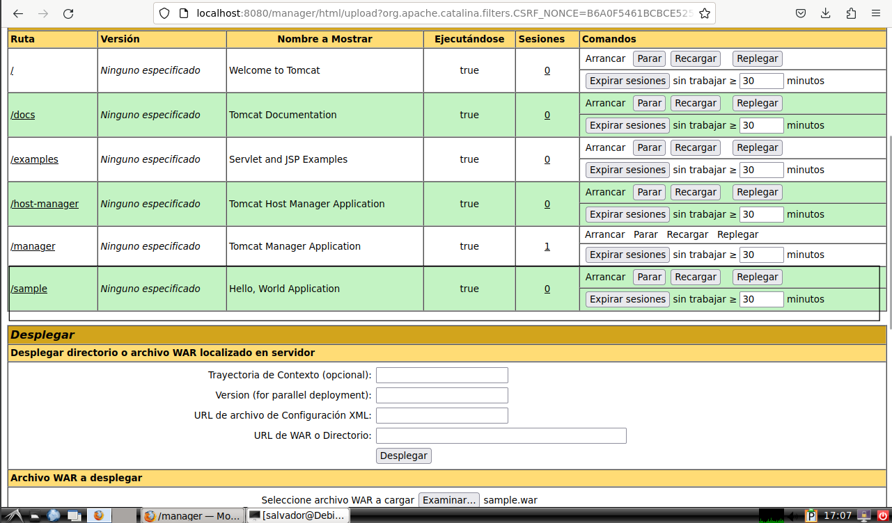
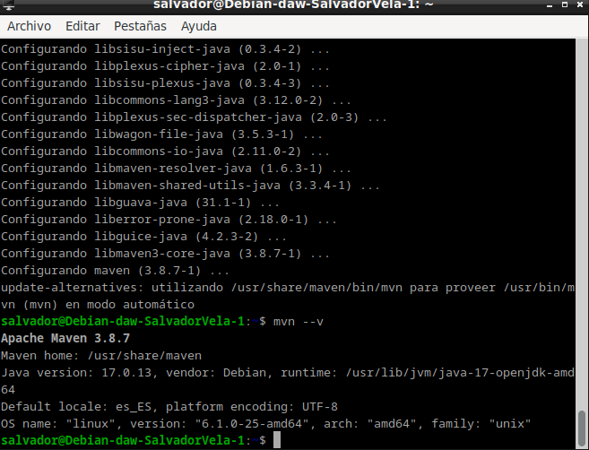
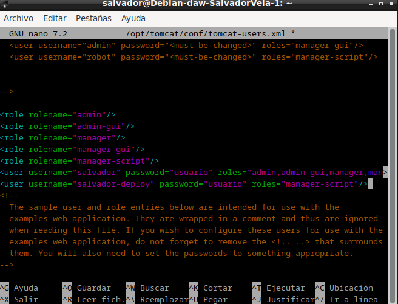
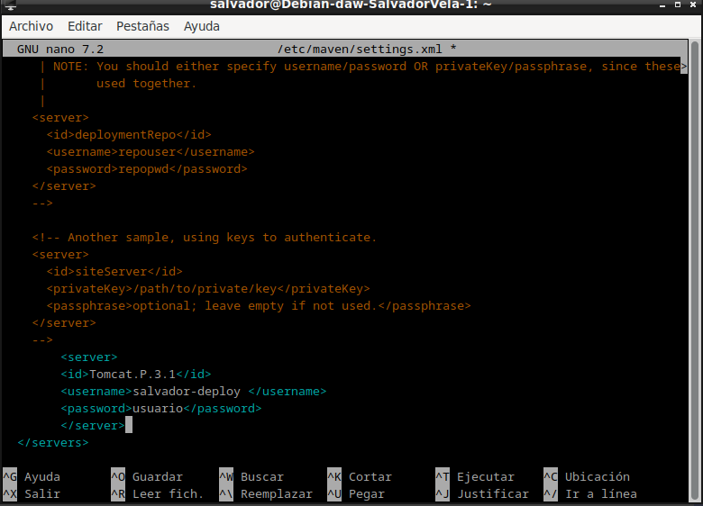
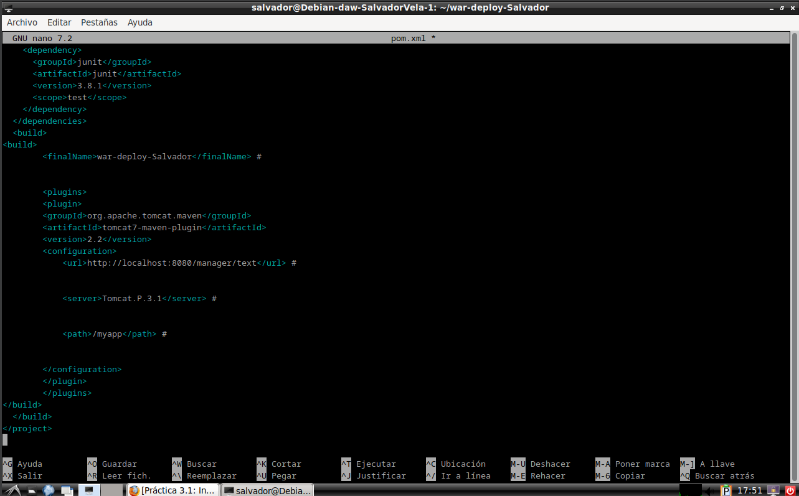
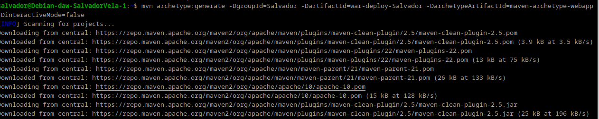
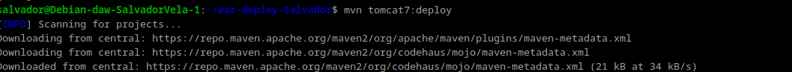
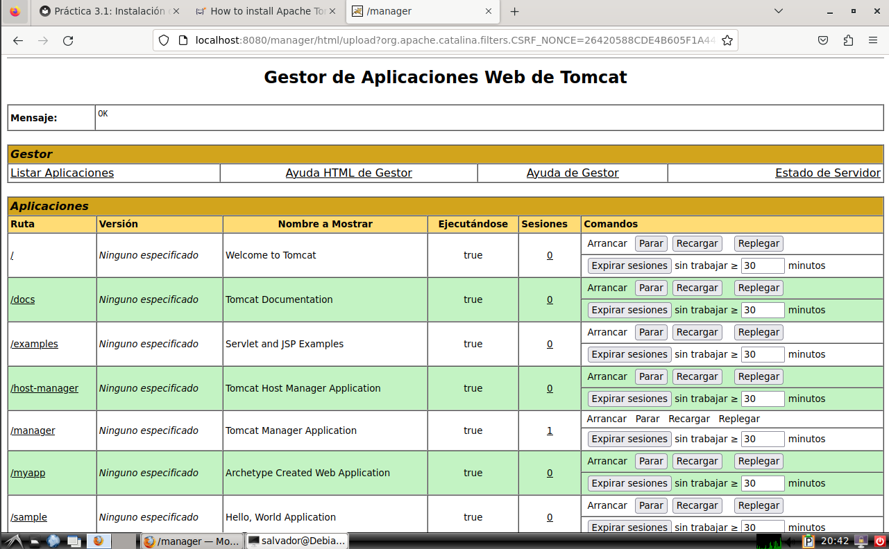

# PRACTICA 3.1

## Despliegue manual mediante la GUI de administración

Realizaremos el despliegue manual de una aplicación ya previamente empaquetada en formato WAR. Para ello:

1. Nos logueamos con el usuario previamente creado.
2. Buscamos la sección que nos permite desplegar un WAR manualmente, seleccionamos nuestro archivo y lo desplegamos.



Tras estos pasos, se nos listará la aplicación ya desplegada como un directorio más y podremos acceder a ella.


Esto detendra tomcat.

## Despliegue con Maven

### Instalación de Maven

Para instalar Maven en nuestro Debian tenemos, de nuevo, dos opciones:

1. Instalación mediante gestor de paquetes APT
2. Instalación manual

La primera, recomendada, es mucho más sencilla y automatizada (establece todos los paths y variables de entorno), aunque con la segunda se podría conseguir un paquete más actualizado.

Ambos métodos vienen explicados [aquí](https://maven.apache.org/install.html).

Si decidimos seguir el primer método, el más sencillo, vemos que es tan simple como actualizar los repositorios:

```bash
sudo apt update
```

E instalar Maven:

```bash
sudo apt install maven
```

Para comprobar que todo ha ido correctamente, podemos ver la versión instalada de Maven:

```bash
mvn --version
```



### Configuración de Maven

Para poder realizar despliegues en nuestro Tomcat previamente instalado, necesitamos realizar la configuración adecuada para Maven. Ya sabemos que esto en Linux significa editar los archivos de configuración adecuados. Vamos a ello.

En primer lugar necesitamos asegurarnos de que en el apartado anterior de la práctica hemos añadido todos los usuarios necesarios, así como sus respectivos roles. Debemos añadir el rol de `manager-script` para permitir que Maven se autentique contra Tomcat y pueda realizar el despliegue.

Los roles utilizados por Tomcat vienen detallados en su [documentación](https://tomcat.apache.org/tomcat-9.0-doc/manager-howto.html), que merece ser consultada.

En dicha documentación se nos indica que, por temas de seguridad, es recomendable no otorgar los roles de `manager-script` o `manager-jmx` al mismo usuario que tenga el rol de `manager-gui`.

> **Info:** Tendremos dos usuarios, uno para la GUI y otro exclusivamente para hacer los deploys de Maven.

Así las cosas, modificamos el archivo `/etc/tomcat9/tomcat-users.xml` (o el `opt/tomcat/conf/tomcat-users.xml` si lo instalamos desde la pagina web sehun nos indica la guia  de instalacion) acorde a nuestras necesidades (los nombres de usuario y contraseña deberán ser los que elijáis para vosotros):

```xml
<role rolename="manager-gui"/>
<role rolename="manager-script"/>
<user username="gui-user" password="gui-password" roles="manager-gui"/>
<user username="script-user" password="script-password" roles="manager-script"/>
```



Editar el archivo `/etc/maven/settings.xml` para indicarle a Maven, un identificador para el servidor sobre el que vamos a desplegar (no es más que un nombre, ponedle el nombre que consideréis), así como las credenciales. Todo esto se hará dentro del bloque `servers` del XML:

```xml
<servers>
    <server>
        <id>Tomcat.P.3.1</id>
        <username>script-user</username>
        <password>script-password</password>
    </server>
</servers>
```



Ahora debemos modificar el `POM` del proyecto para que haga referencia a que el despliegue se realice con el plugin de Maven para Tomcat.

> **Info:** No existen plugins oficiales para Tomcat más allá de la versión 7 del servidor. No obstante, el plugin para Tomcat 7 sigue funcionando correctamente con Tomcat 9.

Otra opción sería utilizar el plugin [Cargo](https://codehaus-cargo.github.io/cargo/Maven2+plugin.html).

Donde lo que añadimos es el bloque:

```xml
<build>
    <finalName>war-deploy</finalName>
    <plugins>
        <plugin>
            <groupId>org.apache.tomcat.maven</groupId>
            <artifactId>tomcat7-maven-plugin</artifactId>
            <version>2.2</version>
            <configuration>
                <url>http://localhost:8080/manager/text</url>
                <server>Tomcat.P.3.1</server>
                <path>/myapp</path>
            </configuration>
        </plugin>
    </plugins>
</build>
```



### Despliegue

Teniendo ya todo listo para realizar despliegues, ahora crearemos una aplicación Java de prueba para ver si podemos desplegarla sobre la arquitectura que hemos montado. Para ello utilizamos el comando:

```bash
mvn archetype:generate -DgroupId=raul -DartifactId=war-deploy -DarchetypeArtifactId=maven-archetype-webapp -DinteractiveMode=false
```



Podéis sustituir los valores de `groupId` y `artifactId` (este será el nombre de la aplicación) por lo que queráis.

Tras generar esta aplicación, los comandos finales que se utilizan en Maven para desplegar, volver a desplegar o desplegar una aplicación, son:

```bash
mvn tomcat7:deploy
mvn tomcat7:redeploy
mvn tomcat7:undeploy
```



Y, accediendo a través de la GUI, debemos ver que la aplicación está desplegada y que podemos acceder a ella perfectamente.

