# Práctica 3.2: Despliegue de aplicaciones con Node Express

## Introducción

En esta práctica vamos a realizar el despliegue de aplicaciones Node.js sobre un servidor Node Express. Lo curioso de este caso es que el despliegue aquí cambia un poco puesto que no se hace sobre el servidor, sino que la aplicación es el servidor.

> **Warning**
>
> Comprueba que el servidor Tomcat de prácticas anteriores no está corriendo o nos dará problemas:
>
> ```bash
> sudo systemctl status tomcat9
> ```
>
> Y en caso de salir activo, pararlo:
>
> ```bash
> sudo systemctl stop tomcat9
> ```

Si no lo has instalado mediante APT, deberás ir al directorio donde lo tengas. En mi caso es `/opt/tomcat` y hacer:

```bash
cd /opt/tomcat/bin
./shutdown.sh
```
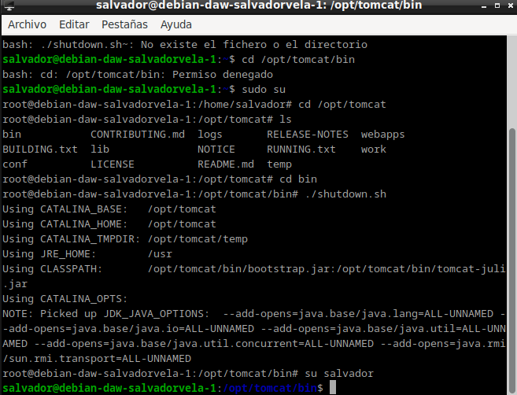

## Instalación de Node.js, Express y test de la primera aplicación

La primera parte de la práctica es muy sencilla. Consistirá en instalar sobre nuestra Debian 11 tanto Node.js como Express y tras ello crear un archivo `.js` de prueba para comprobar que nuestro primer despliegue funciona correctamente.

Para ello, os podéis apoyar en este sencillo tutorial o este otro, Y para Express:

En lugar de acceder a `http://localhost:3000`, debéis acceder desde vuestra máquina local a `http://IP-maq-virtual:3000`, utilizando la IP concreta de vuestra máquina virtual.

> **Recordatorio**
>
> Debéis añadir a vuestro grupo de seguridad el puerto que estéis utilizando para acceder a la aplicación (3000 u otro), permitiendo el tráfico de entrada hacia ese puerto TCP.
>
> Recordad parar el servidor (`CTRL+C`) al acabar la práctica.

## Task

Documenta, incluyendo capturas de pantallas, el proceso que has seguido para realizar el despliegue de esta nueva aplicación, así como el resultado final.

## Instalación de Node.js y Express en Debian 11

Para comenzar, abre una terminal y actualiza el sistema operativo:

```bash
sudo apt update
sudo apt upgrade
```
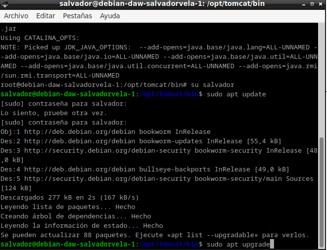

Luego, añade el repositorio de la rama 16.x de NodeJS:

```bash
curl -sL https://deb.nodesource.com/setup_16.x | sudo -E bash -
```
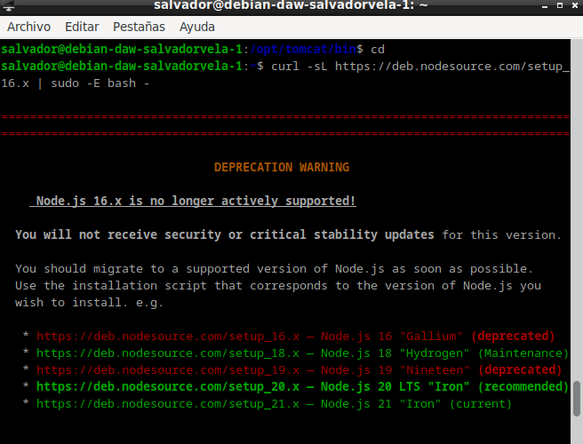

Después, ejecuta el siguiente comando:

```bash
sudo apt install nodejs
```
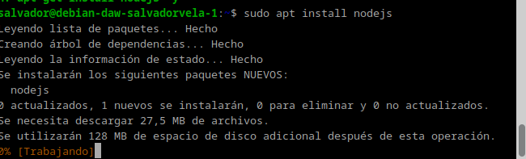

Finalmente, verifica las versiones instaladas de NodeJS y NPM para asegurarte de que la instalación fue exitosa:

```bash
node --version
v16.13.2
npm --version
8.1.2
```
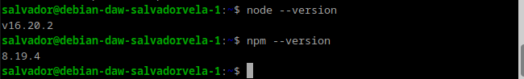

### Instalando ExpressJS en Debian 11

Ahora es momento de instalar Express.js. Para hacerlo de manera global, ejecuta:

```bash
sudo npm install -g express
```
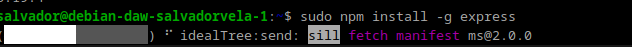

#### 1. Instalando ExpressJS en Debian 11

Primero, crea una carpeta para el proyecto:

```bash
mkdir project
```

Accede a la carpeta:

```bash
cd project
```

Inicializa el proyecto:

```bash
npm init -y
```
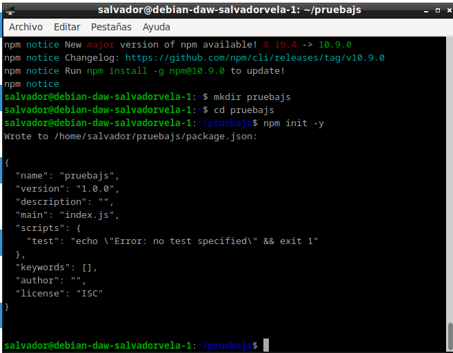

Instala Express.js localmente para este proyecto:

```bash
npm install express
```

Crea un archivo de ejemplo:

```bash
sudo nano app.js
```
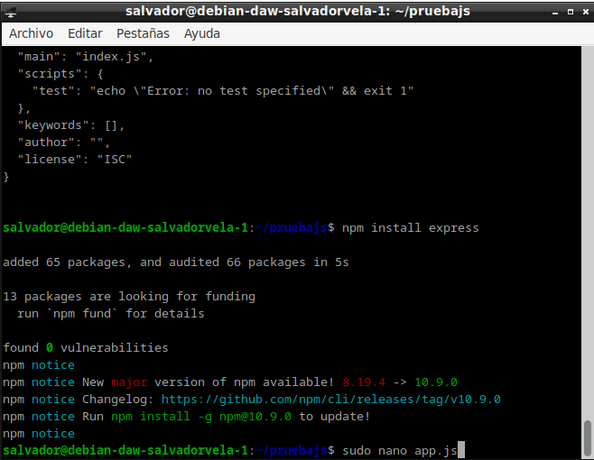

Agrega el siguiente contenido:

```javascript
const express = require('express')
const app = express()
const port = 3000

app.get('/', (req, res) => {
    res.send('Hola. Bienvenido a este blog')
})

app.listen(port, () => {
    console.log(`Aplicación de ejemplo escuchando en http://localhost:${port}`)
})
```
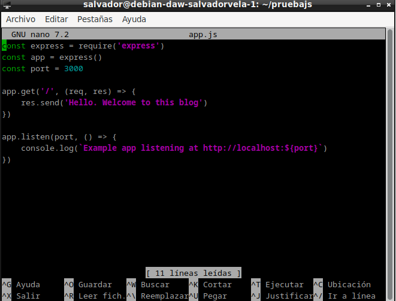

#### 2. Creando una nueva aplicación con Express.js

Guarda los cambios y cierra el editor.

Ejecuta el proyecto con este comando:

```bash
node app.js
```

Salida de ejemplo:

```bash
Aplicación de ejemplo escuchando en http://localhost:3000
```
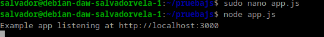
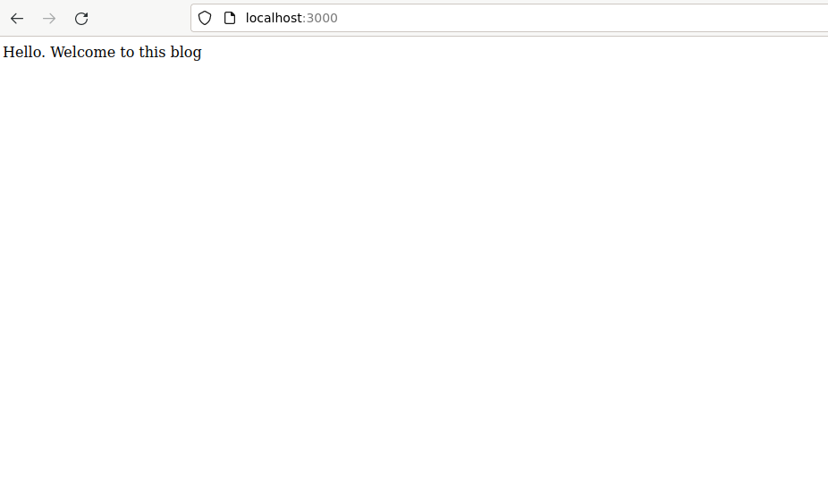

## Despliegue de una nueva aplicación

Vamos ahora a realizar el despliegue de una aplicación de terceros para ver cómo es el proceso.

Se trata de un "prototipo" de una aplicación de predicción meteorológica que podéis encontrar en este repositorio de Github.

Tal y como indican las instrucciones del propio repositorio, los pasos a seguir son, en primer lugar, clonar el repositorio a nuestra máquina:

```bash
git clone https://github.com/MehedilslamRipon/Shopping-Cart-Application
```

Movernos al nuevo directorio:

```bash
cd Shopping-Cart-Application/
```

Instalar las librerías necesarias (paciencia, este proceso puede tardar un buen rato):

```bash
npm install
```
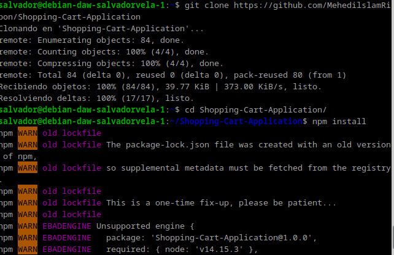

Y, por último, iniciar la aplicación:

```bash
npm run start
```

Cuando sigáis el proceso necesario e intentéis iniciar la aplicación con Express, os dará un error del tipo:

```bash
sh: 1: nodemon: not found
```
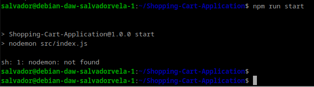

Este error ocurre porque no tenemos instalado el nodemon. para arreglarlo podemos instalarlo globalmente o solo en el proyecto. en mi caso lo hare en el proyecto

para eso tenemos que usar el siguiente comando dentro del proyecto:

```bash
npm install nodemon --save-dev
```
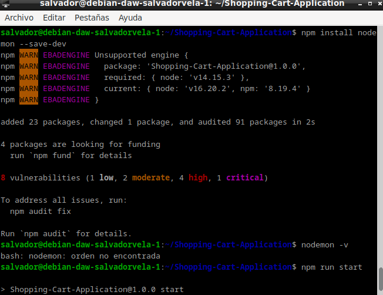
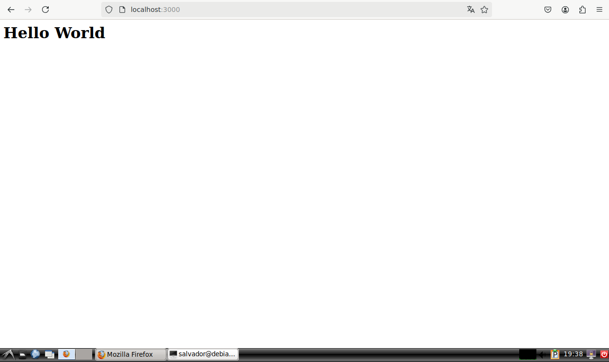


## PRACTICA 3.4

Tras loguearnos por SSH en nuestro Debian, nos crearemos un directorio para albergar la aplicación con el nombre que queramos. En ese directorio, crearemos los 3 archivos (dos .html y un .js) que conformarán nuestra sencilla aplicación de ejemplo:

- head.html
- tail.html
- aplicacion.js

```html
<!DOCTYPE html>
<html>
<head>
    <title>Hola Mundo</title>
</head>
<body>
    <h1>Esta es la pagina principal</h1>
    <p><a href="/tailPage">Ir a la siguiente pagina</a></p>
</body>
</html>
```
```html
<!DOCTYPE html>
<html>
<head>
    <title>Hola Mundo</title>
</head>
<body>
    <h1>Esta es la pagina principal</h1>
    <p><a href="/tailPage">Ir a la siguiente pagina</a></p>
</body>
</html>
```
```javascript
var http = require('http');
var fs = require('fs'); // para obtener los datos del archivo html
var port = process.env.PORT || 8080; 

http.createServer(function (req, res) {
    res.writeHead(200, { 'Content-Type': 'text/html' });

    // req.url almacena el path o ruta de la URL
    var url = req.url;
    if (url === "/") {
// fs.readFile busca el archivo HTML
// el primer parámetro es el path al archivo HTML
// y el segundo es el callback de la función
// si el archivo no se encuentra, la función devuelve un error
// si el archivo se encuentra, el contenido del mismo se encuentra en pgres    
        fs.readFile("head.html", function (err, pgres) {
            if (err)
                res.write("HEAD.HTML NOT FOUND");
            else {
                // Las siguientes 3 lineas
                // tienen la función de enviar el archivo html
                // y finalizar el proceso de respuesta
                res.writeHead(200, { 'Content-Type': 'text/html' });
                res.write(pgres);
                res.end();
            }
        });
    }
    else if (url === "/tailPage") {
        fs.readFile("tail.html", function (err, pgres) {
            if (err)
                res.write("TAIL.HTML NOT FOUND");
            else {
                res.writeHead(200, { 'Content-Type': 'text/html' });
                res.write(pgres);
                res.end();
            }
        });
    }

}).listen(port, function () {
    console.log("SERVER STARTED PORT: 8080");
});
```

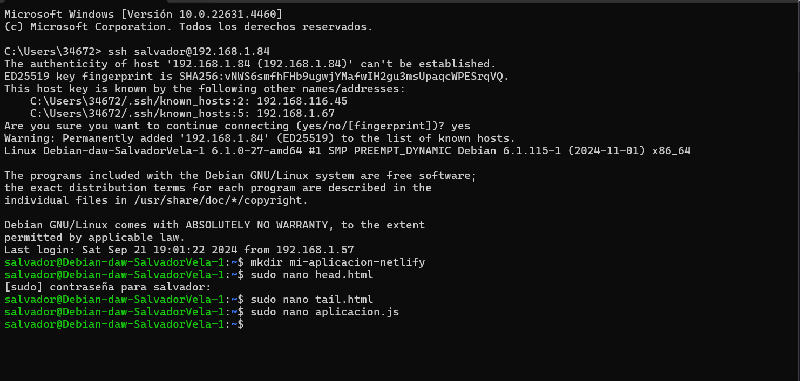
Ahora, tal y como hacemos siempre a la hora de crear nuestra aplicación Node.js, con el fin de crear el archivo package.json, utilizaremos en el terminal el comando:

```bash
npm init
```
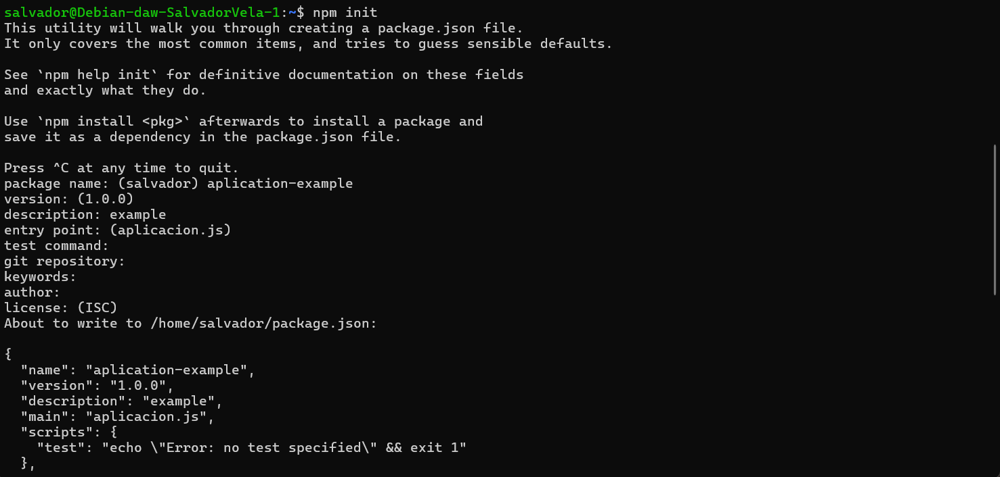
Podemos probar que nuestra aplicación funciona perfectamente en local:

```bash
node aplicacion.js
```
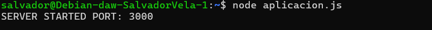
Y tras ello, debemos poder acceder, desde nuestra máquina anfitriona a `http://IP-maq-virtual:8080`

Ya con la aplicación creada y comprobada, podremos desplegarla en múltiples plataformas en la nube, como AWS, GCP, Azure, Digital Ocean, Heroku...

> **Warning**
>
> Para que nos funcione en la plataforma PaaS, en el archivo package.json que se nos ha creado al hacer el npm init debemos hacerle una modificación.
>
> En el bloque scripts, debemos borrar lo que haya dentro y dejar únicamente dentro de él:
>
> ```json
> "start": "node aplicacion.js"
> ```

De forma que el sitio donde la despleguemos sepa que comando utilizar para iniciar la aplicación tras desplegarla.

## Aplicación para Netlify

Puesto que el interés en este módulo radica en el proceso de despliegue, suponiendo que la parte de desarrollo ya es abordada en otros módulos, vamos a utilizar una aplicación de ejemplo que nos ahorre tiempo para centrarnos en el despliegue.

Nos clonaremos este repositorio:

```bash
git clone https://github.com/StackAbuse/color-shades-generator
```
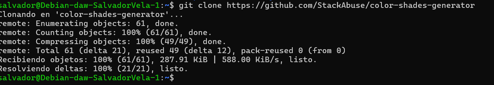
### Proceso de despliegue en Netlify

Por mera curiosidad y ambición de aprendizaje, vamos a ver dos métodos de despliegue en Netlify:

1. Despliegue manual desde el CLI de Netlify, es decir, desde el terminal, a partir de un directorio local de nuestra máquina.
2. Despliegue desde un código publicado en uno de nuestros repositorios de Github

El primero nos permitirá conocer el CLI de Netlify y el segundo nos acercara más a una experiencia real de despliegue.

### Task

Vuestra primera tarea será registraros en Netlify con vuestro email (no con vuestra cuenta de Github) y decirle que no cuando os pida enlazar con vuestra cuenta de Github (lo haremos más adelante).

#### Despliegue mediante CLI

Una vez registrados, debemos instalar el CLI de Netlify para ejecutar sus comandos desde el terminal:

```bash
sudo npm install netlify-cli -g
```

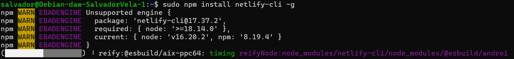

Está claro que para realizar acciones de deploy, Netlify nos solicitará una autenticación, esto se hace mediante el comando:

```bash
netlify login
```
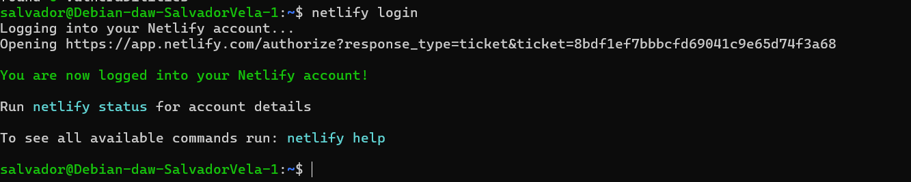
El cual nos muestra una pantalla del navegador para que concedamos la autorización pertinente. Sin embargo, recordemos el problema de que estamos conectados por SSH a nuestro servidor y no tenemos la posibilidad del uso de un entorno gráfico.

En este caso, siguiendo las instrucciones de la documentación:

Generamos el token de acceso
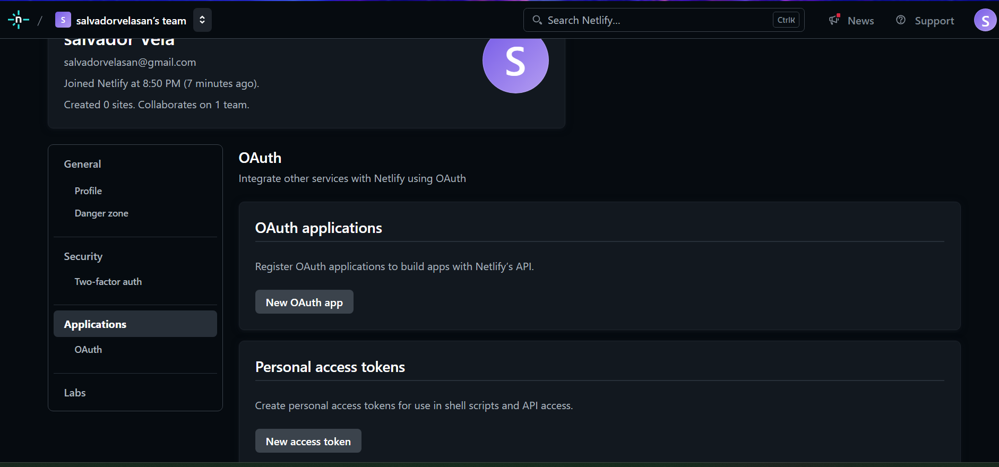
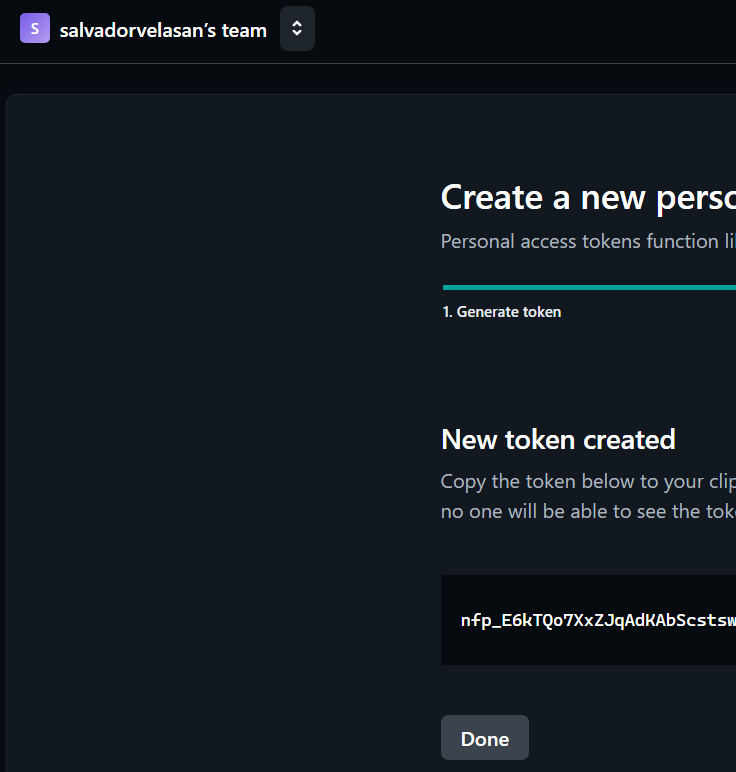
Lo establecemos como variable de ambiente:

Y nos logueamos


```bash
netlify login
```
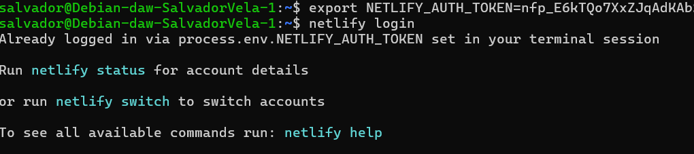

Bueno, tenemos el código de nuestra aplicación, tenemos nuestra cuenta en Netlify y tenemos el CLI necesario para ejecutar comandos desde el terminal en esa cuenta... ¿Podemos proceder al despliegue sin mayores complicaciones?

La respuesta es NO, como buenos desarrolladores y en base a experiencias anteriores, ya sabéis que hay que hacer un build de la aplicación para, posteriormente, desplegarla. Vamos a ello.

En primer lugar, como sabemos, debemos instalar todas las dependencias que vienen indicadas en el archivo package.json:

```bash
npm install
```
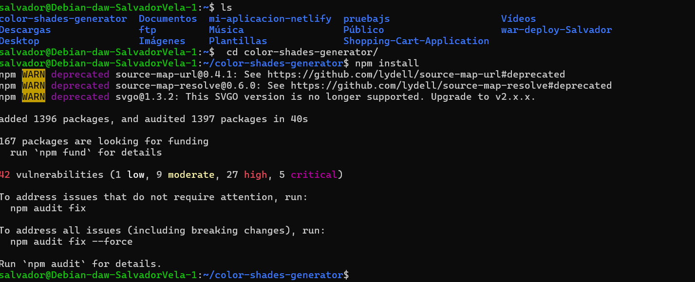
Y cuando ya las tengamos instaladas podemos proceder a realizar el build:

```bash
npm run build
```
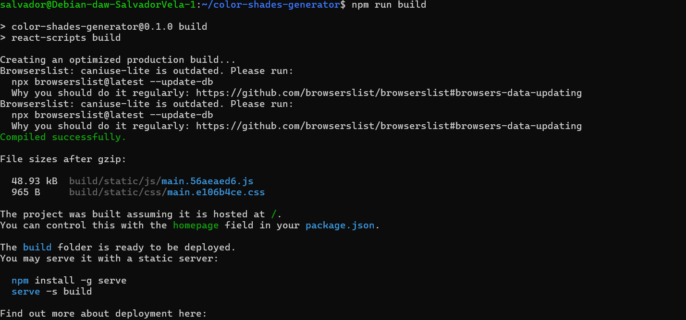
Esto nos creará una nueva carpeta llamada build que contendrá la aplicación que debemos desplegar. Y ya podemos hacer un pre-deploy de la aplicación de la que hemos hecho build antes:

```bash
netlify deploy
```
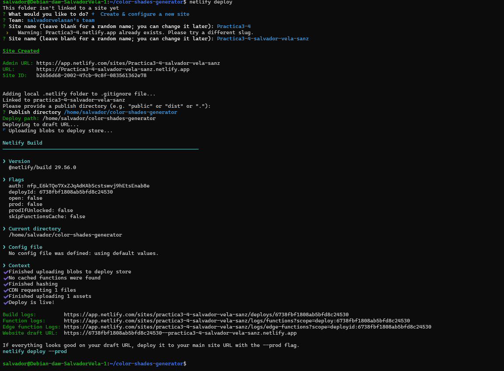
Nos hará algunas preguntas para el despliegue:
- Indicamos que queremos crear y configurar un nuevo site
- El Team lo dejamos por defecto
- Le indicamos el nombre que queremos emplear para la web (nombre-practica3-4) y el directorio a utilizar para el deploy (directorio ./build).

Y si nos indica que todo ha ido bien e incluso podemos ver el "borrador" (Website Draft URL) de la web que nos aporta, podemos pasarla a producción finalmente tal y como nos indica la misma salida del comando:

```bash
If everything looks good on your draft URL, deploy it to your main site URL with the --prod flag.
netlify deploy --prod
```
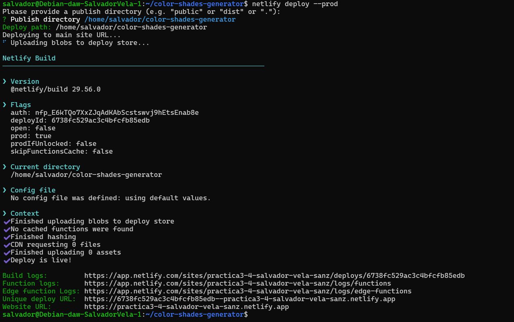

> **Warning**
>
> No olvides desplegar finalmente en producción y comprobar que puedes acceder a la URL.

#### Despliegue mediante conexión con Github

En primer lugar, vamos a eliminar el site que hemos desplegado antes en Netlify para evitarnos cualquier problema y/o conflicto:

En segundo lugar, vamos a borrar el directorio donde se halla el repositorio clonado en el paso anterior para así poder empezar de 0:

```bash
rm -rf directorio_repositorio
```

Como queremos simular que hemos picado el código a mano en local y lo vamos a subir a Github por primera vez, nos descargaremos los fuentes en formato .zip sin que tenga ninguna referencia a Github:

```bash
wget https://github.com/StackAbuse/color-shades-generator/archive/refs/heads/main.zip
```

Creamos una carpeta nueva y descomprimimos dentro el zip:

```bash
mkdir practica3.4
unzip main.zip -d practica3.4/
```
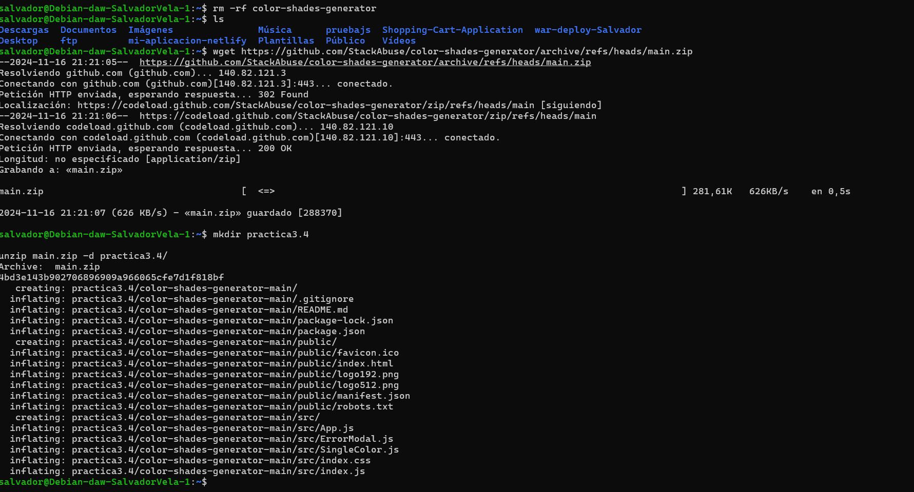

Entramos en la carpeta donde está el código:

```bash
cd practica3.4/color-shades-generator-main/
```

Ahora debemos crear un repositorio completamente vacío en Github que se llame practicaTresCuatro:

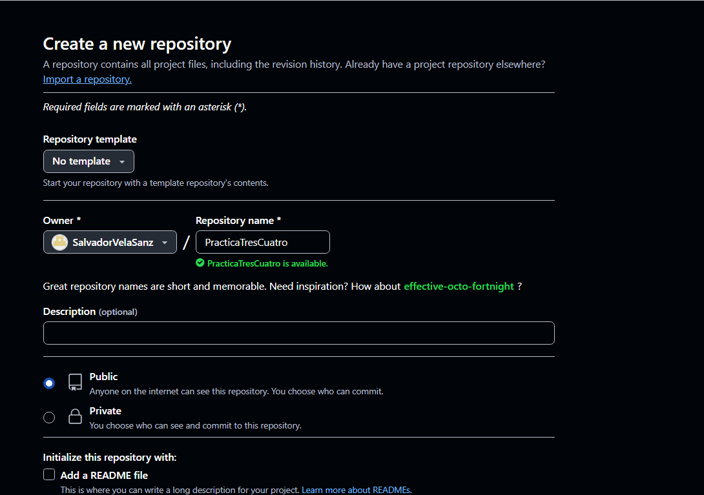
Y tras ello, volviendo al terminal a la carpeta donde estábamos, la iniciamos como repositorio, añadimos todo el contenido de la misma para el commit, hacemos el commit con el mensaje correspondiente y creamos la rama main:

```bash
$ git init
$ git add .
$ git commit -m "Subiendo el código..."
$ git branch -M main
```

Y ahora sólo queda referenciar nuestra carpeta al repositorio recién creado en Github y hacer un push para subir todo el contenido del commit a él:

```bash
$ git remote add origin https://github.com/username/practicaTresCuatro.git
$ git push -u origin main
```
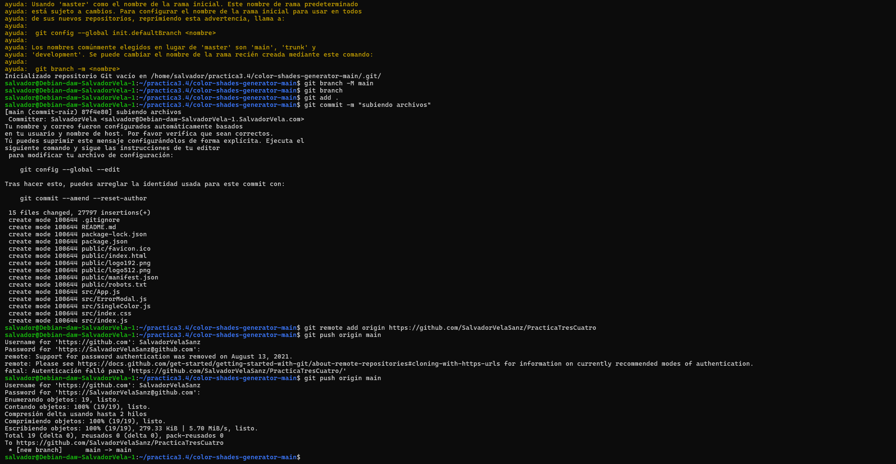
Ahora que ya tenemos subido el código a GitHub, de alguna manera debemos enganchar o enlazar nuestra cuenta de Github con la de Netlify para que éste último pueda traerse el código de allí, hacer el build y desplegarlo. Así pues, entramos en nuestro dashboard de Netlify y le damos a importar proyecto existente de git:

Le indicamos que concretamente de Github:

Y nos saltará una ventana pidiendo que autoricemos a Netlify a acceder a nuestros repositorios de Github:

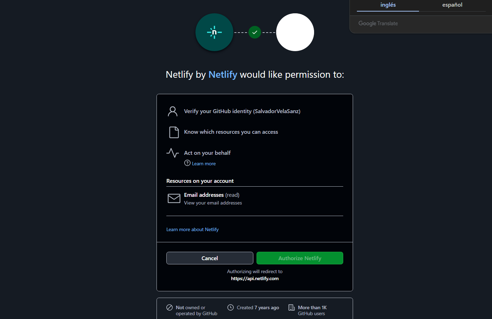

Y luego le indicaremos que no acceda a todos nuestros repositorios sino sólo al repositorio que necesitamos, que es donde tenemos el código de nuestra aplicación:
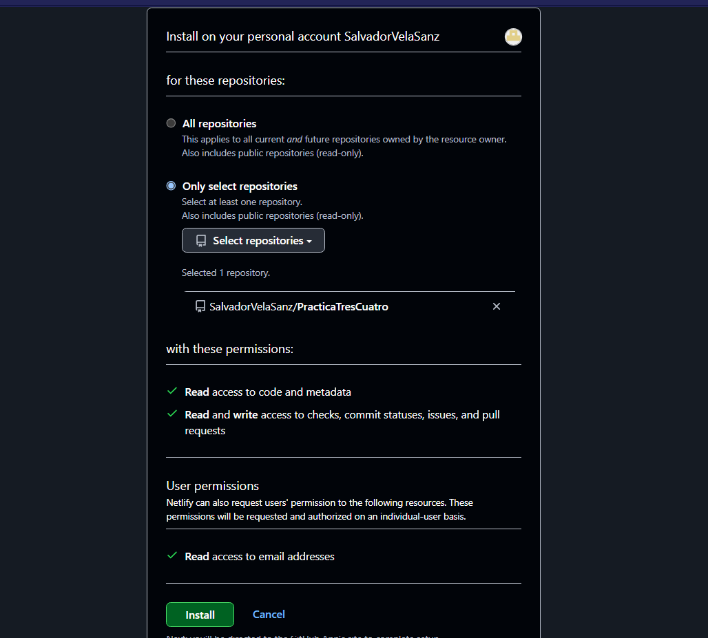
Y ya quedará todo listo:
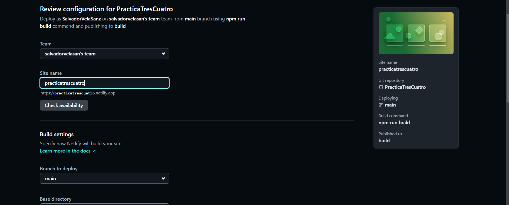
Y desplegamos la aplicación:

Netlify se encargará de hacer el build de forma automática tal y como hemos visto en la imagen de arriba, con el comando npm run build, publicando el contenido del directorio build.

> **Atención**
>
> Tras el deploy, en "Site settings" podéis y debéis cambiar el nombre de la aplicación por nombre-practica3-4, donde nombre es vuestro nombre.

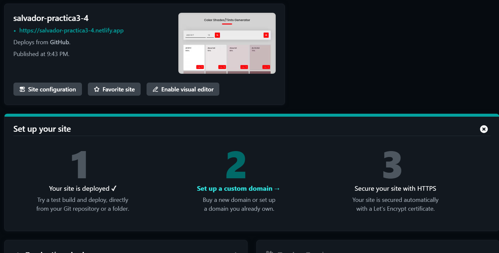

Lo que hemos conseguido de esta forma es que, cualquier cambio que hagamos en el proyecto y del que hagamos commit y push en Github, automáticamente genere un nuevo despliegue en Netlify. Es el principio de lo que más adelante veremos como despliegue continuo.

Comprobemos que realmente es así:

Dentro de la carpeta public encontramos el archivo robots.txt, cuyo cometido es indicar a los rastreadores de los buscadores a qué URLs del sitio pueden acceder. A este archivo se puede acceder a través de la URL del site:

Dentro de la carpeta public, utilizando el editor de texto que prefiráis en vuestro terminal, modificad el archivo robots.txt para que excluya un directorio que se llame nombre_apellido, utilizando obviamente vuestro nombre y apellido.

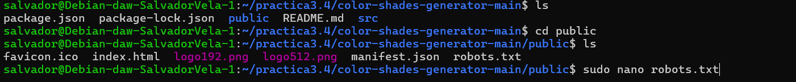
```txt
User-agent: *
Disallow: /nombre_y_apellido/
```
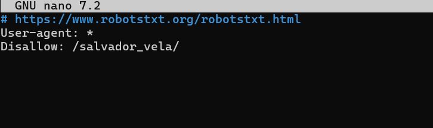
Haz un nuevo commit y push (del caso anterior, recuerda el comando git previo para añadir los archivos a hacer commit)

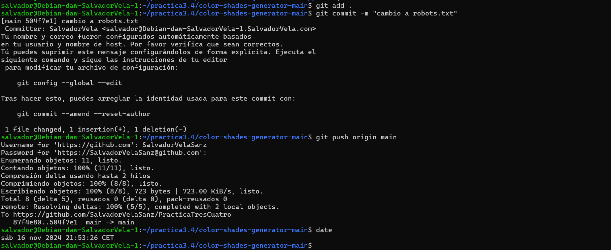

Comprueba en el dashboard de Netlify que se ha producido un nuevo deploy de la aplicación hace escasos segundos
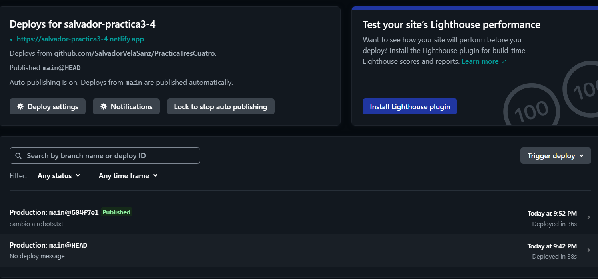
Accede a `https://url_de_la_aplicacion/robots.txt` y comprueba que, efectivamente, se ve reflejado el cambio
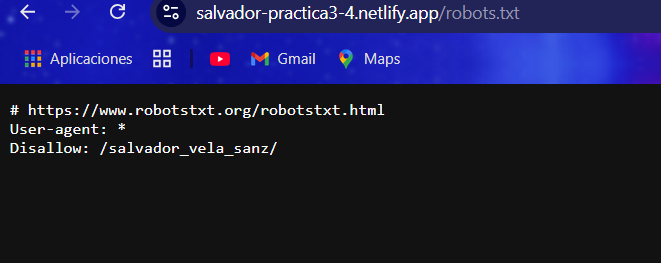