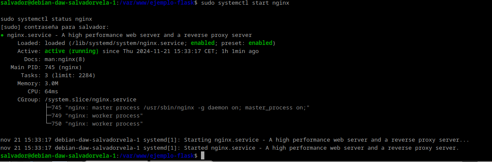

# Procedimiento completo para el despliegue

## Instalación de pip

Instalamos el gestor de paquetes de Python pip:

```bash
sudo apt update
sudo apt install python3-pip
```


## Instalación de pipenv

Instalamos el paquete pipenv para gestionar los entornos virtuales:

```bash
sudo apt install pipenv
```


Y comprobamos que está instalado correctamente mostrando su versión:

```bash
pipenv --version
```


## Creación del directorio del proyecto

Creamos el directorio en el que almacenaremos nuestro proyecto:

```bash
sudo mkdir /var/www/nombre_mi_aplicacion
```

Al crearlo con `sudo`, los permisos pertenecen a root. Hay que cambiarlo para que el dueño sea nuestro usuario (raul-debian en mi caso) y pertenezca al grupo `www-data`, el usuario usado por defecto por el servidor web para correr:

```bash
sudo chown -R $USER:www-data /var/www/mi_aplicacion
```

Establecemos los permisos adecuados a este directorio, para que pueda ser leído por todo el mundo:

```bash
chmod -R 775 /var/www/mi_aplicacion
```


> **Warning**
>
> Es indispensable asignar estos permisos, de otra forma obtendríamos un error al acceder a la aplicación cuando pongamos en marcha Nginx.

## Creación del archivo .env

Dentro del directorio de nuestra aplicación, creamos un archivo oculto `.env` que contendrá las variables de entorno necesarias:

```bash
touch .env
```


Editamos el archivo y añadimos las variables, indicando cuál es el archivo `.py` de la aplicación y el entorno, que en nuestro caso será producción.


> **Nota**
>
> En el mundo laboral real, se supone que la aplicación previamente ha pasado por los entornos de dev, test y preprod para el desarrollo y prueba de la misma, antes de pasarla a producción.

## Iniciar el entorno virtual

Iniciamos ahora nuestro entorno virtual. Pipenv cargará las variables de entorno desde el fichero `.env` de forma automática:

```bash
pipenv shell
```


Veremos que se nos inicia el entorno virtual, cosa que comprobamos porque aparece su nombre al inicio del prompt del shell.

## Instalación de dependencias

Usamos pipenv para instalar las dependencias necesarias para nuestro proyecto:

```bash
pipenv install flask gunicorn
```


## Creación de la aplicación Flask

Vamos ahora a crear la aplicación Flask más simple posible, a modo de PoC (proof of concept o prueba de concepto). El archivo que contendrá la aplicación propiamente dicha será `application.py` y `wsgi.py` se encargará únicamente de iniciarla y dejarla corriendo:

```bash
touch application.py wsgi.py
```

Y tras crear los archivos, los editamos para dejarlos así.


## Comprobación de la aplicación Flask

Corramos ahora nuestra aplicación a modo de comprobación con el servidor web integrado de Flask. Si especificamos la dirección `0.0.0.0` lo que le estamos diciendo al servidor es que escuche en todas sus interfaces, si las tuviera.

Ahora podremos acceder a la aplicación desde nuestro ordenador, nuestra máquina anfitrión, introduciendo en un navegador web: `http://IP-maq-virtual:5000`.

Tras la comprobación, paramos el servidor con `CTRL+C`.


> **Recordatorio**
>
> Habrás de abrir el puerto correspondiente en el grupo de seguridad.

## Comprobación de Gunicorn

Comprobemos ahora que Gunicorn funciona correctamente también. Si os ha funcionado el servidor de desarrollo de Flask, podéis usar el siguiente comando para probar que la aplicación funciona correctamente usando Gunicorn, accediendo con vuestro navegador de la misma forma que en el paso anterior:

```bash
gunicorn --workers 4 --bind 0.0.0.0:5000 wsgi:app
```

Donde:
- `--workers N` establece el número de workers o hilos que queremos utilizar, como ocurría con Node Express. Dependerá del número de cores que le hayamos dado a la CPU de nuestra máquina virtual.
- `--bind 0.0.0.0:5000` hace que el servidor escuche peticiones por todas sus interfaces de red y en el puerto 5000.
- `wsgi:app` es el nombre del archivo con extensión `.py` y `app` es la instancia de la aplicación Flask dentro del archivo.


Todavía dentro de nuestro entorno virtual, debemos tomar nota de cuál es el path o ruta desde la que se ejecuta gunicorn para poder configurar más adelante un servicio del sistema. Podemos averiguarlo así:


> **Tip**
>
> Y tras ello debemos salir de nuestro entorno virtual con el sencillo comando `deactivate`.


## Iniciar Nginx

Puesto que ya debemos tener instalado Nginx en nuestro sistema, lo iniciamos y comprobamos que su estado sea activo:

```bash
sudo systemctl start nginx
sudo systemctl status nginx
```


## Creación del servicio systemd

Ya fuera de nuestro entorno virtual, crearemos un archivo para que systemd corra Gunicorn como un servicio del sistema más.

Donde:
- `User`: Establece el usuario que tiene permisos sobre el directorio del proyecto (el que pusistéis en el paso 5).
- `Group`: Establece el grupo que tiene permisos sobre el directorio del proyecto (el que pusistéis en el paso 5).
- `Environment`: Establece el directorio bin (donde se guardan los binarios ejecutables) dentro del entorno virtual (lo visteis en el paso 14).
- `WorkingDirectory`: Establece el directorio base donde reside nuestro proyecto.
- `ExecStart`: Establece el path donde se encuentra el ejecutable de gunicorn dentro del entorno virtual, así como las opciones y comandos con los que se iniciará.


> **Warning**
>
> Debéis cambiar los valores para que coincidan con los de vuestro caso particular.

Ahora, como cada vez que se crea un servicio nuevo de systemd, se habilita y se inicia:

```bash
systemctl enable nombre_mi_servicio
systemctl start nombre_mi_servicio
```


Recordad que el nombre del servicio es el nombre del archivo que creasteis en el paso anterior.

## Configuración de Nginx

Pasemos ahora a configurar Nginx, que es algo que ya deberíamos tener dominado de capítulos anteriores.

Creamos un archivo con el nombre de nuestra aplicación y dentro estableceremos la configuración para ese sitio web. El archivo, como recordáis, debe estar en `/etc/nginx/sites-available/nombre_aplicacion` y tras ello lo editamos para que quede:

```nginx
server {
    listen 80;
    server_name mi_aplicacion www.mi_aplicacion;

    access_log /var/log/nginx/mi_aplicacion.access.log;
    error_log /var/log/nginx/mi_aplicacion.error.log;

    location / { 
            include proxy_params;
            proxy_pass http://unix:/var/www/nombre_aplicacion/nombre_aplicacion.sock;
    }
}
```


Recordemos que ahora debemos crear un link simbólico del archivo de sitios webs disponibles al de sitios web activos:

```bash
sudo ln -s /etc/nginx/sites-available/nombre_aplicacion /etc/nginx/sites-enabled/
```

Y nos aseguramos de que se ha creado dicho link simbólico:

```bash
ls -l /etc/nginx/sites-enabled/ | grep nombre_aplicacion
```

Nos aseguramos de que la configuración de Nginx no contiene errores, reiniciamos Nginx y comprobamos que su estado es activo:

```bash
nginx -t
sudo systemctl restart nginx
sudo systemctl status nginx
```


Ya no podremos acceder por IP a nuestra aplicación ya que ahora está siendo servida por Gunicorn y Nginx, necesitamos acceder por su `server_name`. Puesto que aún no hemos tratado con el DNS, vamos a editar el archivo `/etc/hosts` de nuestra máquina anfitriona para que asocie la IP de la máquina virtual, a nuestro `server_name`.

Este archivo, en Linux, está en: `/etc/hosts`.

Y en Windows: `C:\Windows\System32\drivers\etc\hosts`.

Y deberemos añadirle la línea:

```
192.168.X.X myproject www.myproject
```

donde debéis sustituir la IP por la que tenga vuestra máquina virtual.


El último paso es comprobar que todo el desplieuge se ha realizado de forma correcta y está funcionando, para ello accedemos desde nuestra máquina anfitrión a:

http://nombre_aplicacion

O:

http://www.nombre_aplicacion

Y debería mostraros la misma página que en el paso 14:


## Cuestiones
### Cuestion 1

Busca, lee, entiende y explica qué es y para que sirve un servidor WSGI


Un servidor WSGI (Web Server Gateway Interface) es una interfaz estándar que conecta aplicaciones web escritas en Python con servidores web como Apache o Nginx. Actúa como intermediario, recibiendo solicitudes HTTP del servidor y pasándolas a la aplicación Python para su procesamiento, y luego devolviendo las respuestas al cliente. Es esencial para ejecutar aplicaciones Python en producción, garantizando compatibilidad entre servidores y frameworks, además de ofrecer escalabilidad y eficiencia