# Práctica 4.1 - Configuración de un servidor DNS

## Instalación de servidor DNS


Para instalar el servidor DNS en Ubuntu podemos instalarlo como cualquier paquete en Ubuntu:

```bash
sudo apt-get install bind9 bind9utils bind9-doc
```
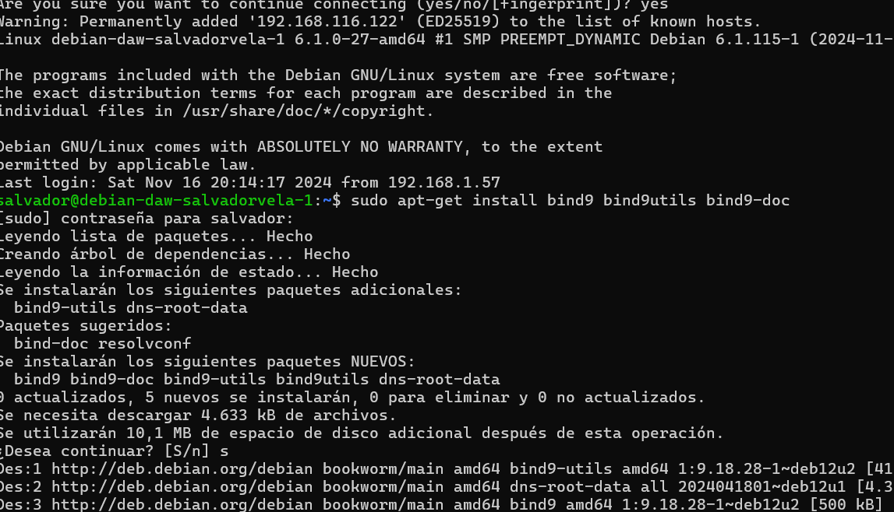

## Configuración del servidor

Puesto que en clase sólo vamos a utilizar IPv4, en su archivo general de configuración  named que se encuentra en el directorio:

`/etc/default`
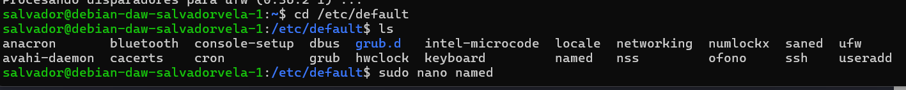

Y para indicarle que sólo use IPv4, debemos modificar esto:

```plaintext
OPTIONS = "-u bind -4"
```
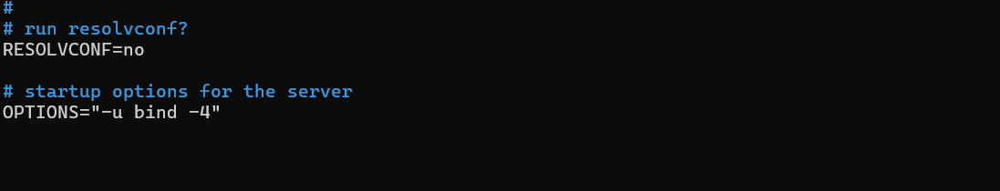

El archivo de configuración principal named.conf de Bind está en el directorio:

`/etc/bind`
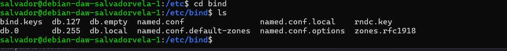


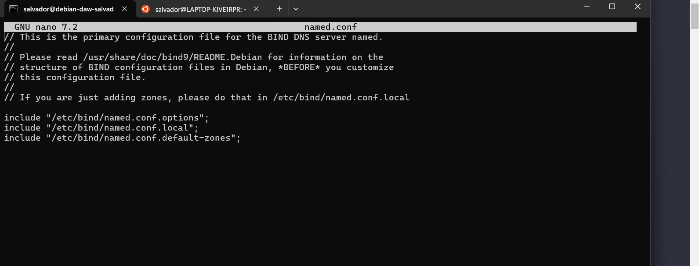

### Configuración named.conf.options

Usamos este comando para hacer una copia de seguridad 
```bash
sudo cp /etc/bind/named.conf.options /etc/bind/named.conf.options.backup
```
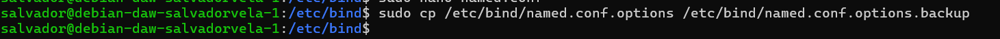

Ahora editaremos el archivo named.conf.options e incluiremos los siguientes contenidos:

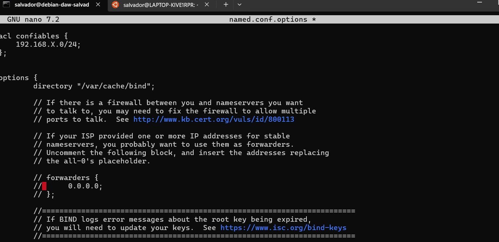


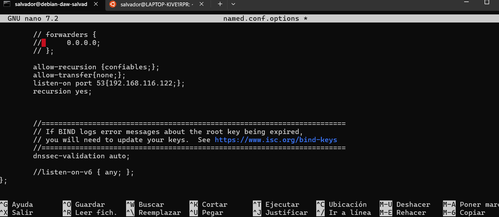

Podemos comprobar si nuestra configuración es correcta con el comando:

```bash
sudo named-checkconf
```

Si hay algún error aparecera a la hora de ejecutar el comando, si no nos devuelve a la línea de comandos.

Reiniciamos el servidor y comprobamos su estado:

```bash
sudo systemctl restart bind9
sudo systemctl status bind9
```
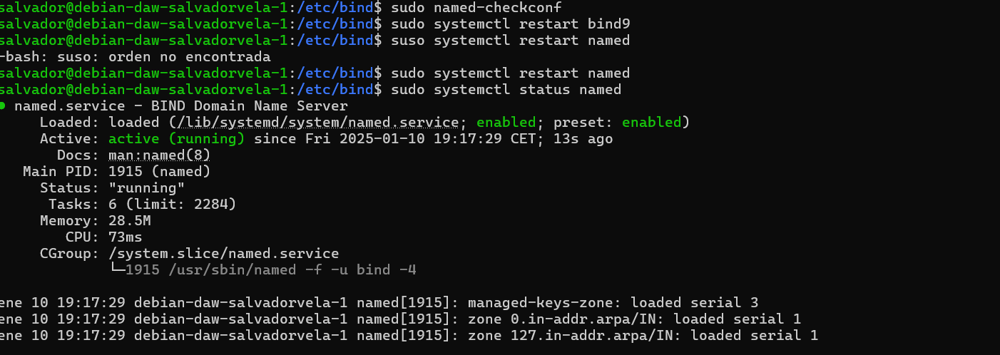

### Configuración named.conf.local

En este archivo configuraremos aspectos relativos a nuestras zonas. Vamos a declarar la zona “deaw.es”. 

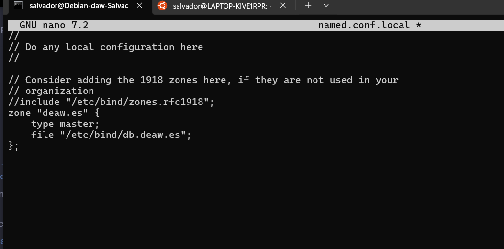

### Creación del archivo de zona

Creamos el archivo de la zona directa en el directorio que le hemos especificado antes.

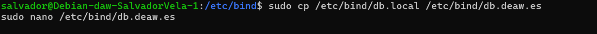

El contenido será algo así (respetar el formato):

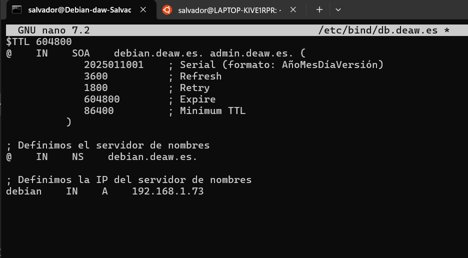

### Creación del archivo de zona para la resolución inversa

Ahora se tiene que crear el archivo de la resolucion inversa, para ello en el mismo lugar que en la zona direxta se pone esto

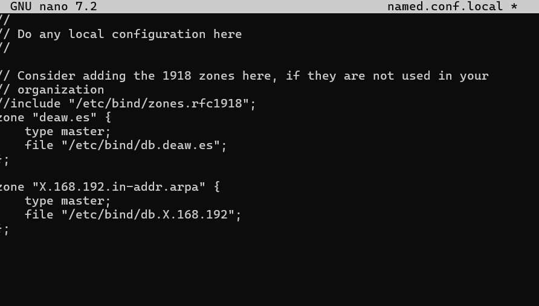

Donde la X es el tercer byte de la red de la maquina.

Y se crea el archivo correspondiente con su configuracion:

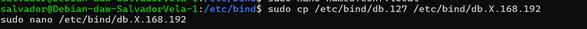
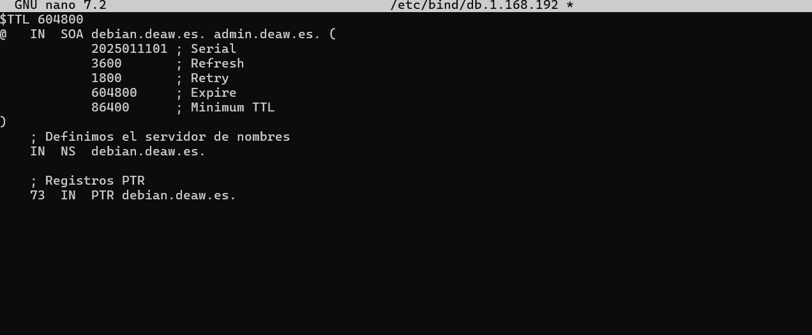


### Comprobación de las configuraciones

Para comprobar la configuración de la zona de resolución directa:

```bash
sudo named-checkzone deaw.es /etc/bind/db.deaw.es
```

Y para comprobar la configuración de la zona de resolución inversa:

```bash
sudo named-checkzone X.168.192.in-addr.arpa /etc/bind/db.X.168.192
```

Si todo está bien, devolverá OK. 

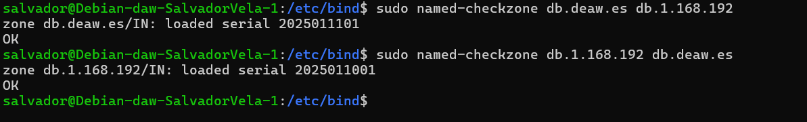

Reiniciamos el servicio y comprobamos el estado:

```bash
sudo systemctl restart bind9
sudo systemctl status bind9
```
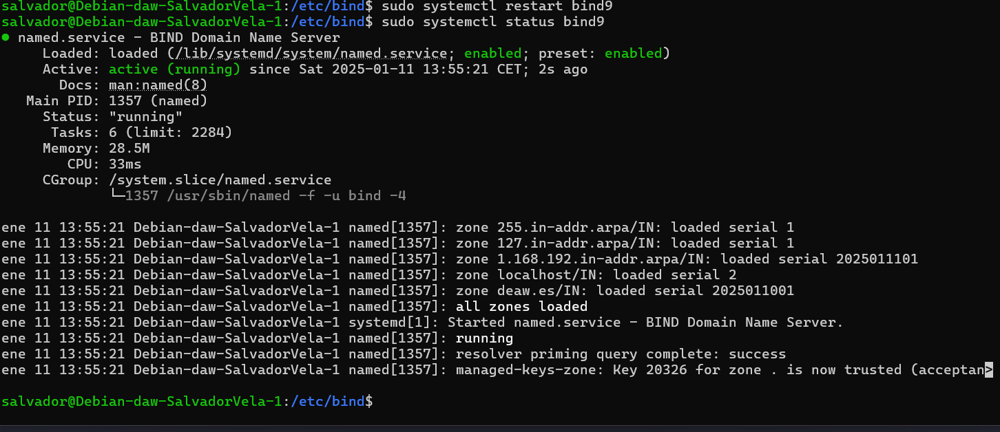

## Atención

Es muy importante que el cliente esté configurado para usar como servidor DNS el que acabamos de instalar y 
configurar. Ya sea Windows, ya sea Linux, debéis cambiar vuestra configuración de red para que la máquina con la 
que hagáis las pruebas utilice este servidor DNS como el principal.

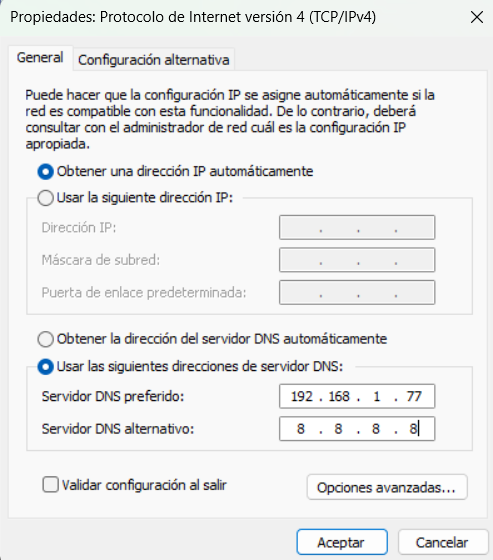

## Comprobación de las resoluciones y de las consultas

Podemos comprobar desde los clientes, con `dig` o `nslookup` las resoluciones directas e inversas en mi caso usare nslookup.

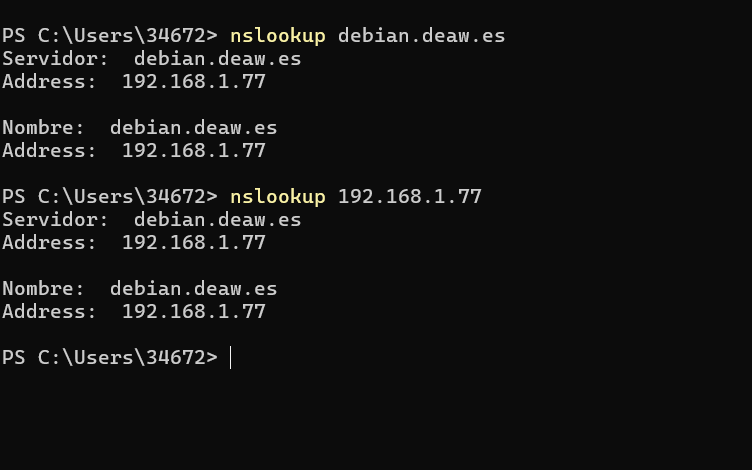

## Cuestiones finales

### Cuestión 1 ¿Qué pasará si un cliente de una red diferente a la tuya intenta hacer uso de tu DNS de alguna manera, le funcionará? ¿Por qué, en qué parte de la configuración puede verse?

No le funcionará porque en la configuración del servidor DNS se especifican las redes o clientes 
que tienen permitido hacer consultas. Esto se define en la ACL (allow-query en el archivo named.conf.options). 
Si una IP o red no está incluida en esta lista, las consultas serán rechazadas.

### Cuestión 2 ¿Por qué tenemos que permitir las consultas recursivas en la configuración?

Las consultas recursivas permiten que el servidor DNS resuelva nombres de dominio que no están definidos
en sus zonas configuradas localmente. Esto es útil para que los clientes puedan acceder a dominios externos
como google.com a través de nuestro servidor. Sin consultas recursivas, el servidor solo respondería consultas
sobre las zonas para las que es autoritativo.

### Cuestión 3 ¿El servidor DNS que acabáis de montar, es autoritativo? ¿Por qué?

Sí, es autoritativo para las zonas configuradas específicamente (como deaw.es). 
Un servidor es autoritativo si tiene los datos originales de la zona y puede proporcionar respuestas definitivas
para los nombres en esa zona. Esto se configura en los archivos de zona directa e inversa.

### Cuestión 4 ¿Dónde podemos encontrar la directiva $ORIGIN y para qué sirve?

La directiva $ORIGIN se encuentra en los archivos de zona y se utiliza para establecer un dominio base 
para los registros que se definen después de ella. Si no se especifica un dominio completo en un registro,
se añade automáticamente el valor de $ORIGIN. Por defecto, $ORIGIN toma el nombre de la zona configurada.

### Cuestión 5 ¿Una zona es idéntico a un dominio?

No, una zona es una parte de un dominio que está bajo la administración de un servidor DNS.
Un dominio puede estar compuesto por múltiples zonas. 

### Cuestión 6 ¿Pueden editarse los archivos de zona de un servidor esclavo/secundario?

No, los archivos de zona de un servidor esclavo no pueden editarse directamente porque estos son copias sincronizadas
automáticamente desde el servidor maestro. Cualquier cambio debe hacerse en el servidor maestro, y el esclavo
actualizará sus datos mediante transferencia de zona.

### Cuestión 7 ¿Por qué podría querer tener más de un servidor esclavo para una misma zona?

Tener más de un servidor esclavo proporciona redundancia y mejora la disponibilidad del servicio DNS. 
Si el servidor maestro o uno de los esclavos falla, los clientes aún pueden resolver nombres utilizando
otro servidor esclavo.

### Cuestión 8 ¿Cuántos servidores raíz existen?

Existen 13 servidores raíz identificados por las letras de la "A" a la "M".

### Cuestión 9 ¿Qué es una consulta iterativa de referencia?

Una consulta iterativa de referencia es un tipo de consulta realizada en el sistema DNS para resolver un nombre de 
dominio de manera eficiente, donde el cliente DNS  se comunica con varios servidores DNS de manera secuencial hasta

obtener una respuesta final.
### Cuestión 10 En una resolución inversa, ¿a qué nombre se mapearía la dirección IP 172.16.34.56?

La dirección IP 172.16.34.56 se mapearía al nombre 56.34.16.172.in-addr.arpa.