El objetivo de esta práctica es configurar un servidor Nginx que utilice hosts virtuales para alojar múltiples sitios web en un solo servidor y que cada host virtual apunte al directorio `public_html` de distintos usuarios del sistema operativo Debian. De esta manera, cada usuario podrá gestionar su propio sitio web desde su carpeta personal.

## Instalación de Nginx

Para poder hacer esto necesitamos instalar Nginx. Si no está instalado, los pasos para hacerlo son:

1. Actualizamos el sistema con este comando:
    ```bash
    sudo apt update && sudo apt upgrade -y
    ```

2. Instalamos Nginx con este comando:
    ```bash
    sudo apt install nginx -y
    ```

3. Verificamos si está activo con este comando:
    ```bash
    sudo systemctl status nginx
    ```

    Debería de salir esto si está funcionando:

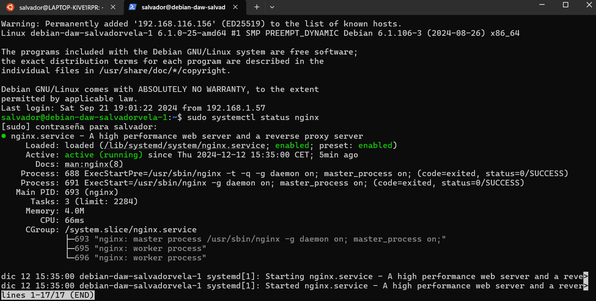

4. Si no está activo, lo activamos con este comando:
    ```bash
    sudo systemctl start nginx
    ```

Una vez hecho esto, Nginx debería estar funcionando correctamente, por lo que ya podremos empezar con la creación de los usuarios.

## Creación de Usuarios

Para la creación de los usuarios, en este caso dos de ellos, tendremos que usar los siguientes comandos:
```bash
sudo adduser usuario1
sudo adduser usuario2
```

Una vez que hagamos esto, nos pedirá que le asociemos una contraseña a cada usuario nuevo que creemos. Además de la contraseña, también se le asociarán más datos que para esta práctica se pueden dejar en blanco, como número de teléfono...

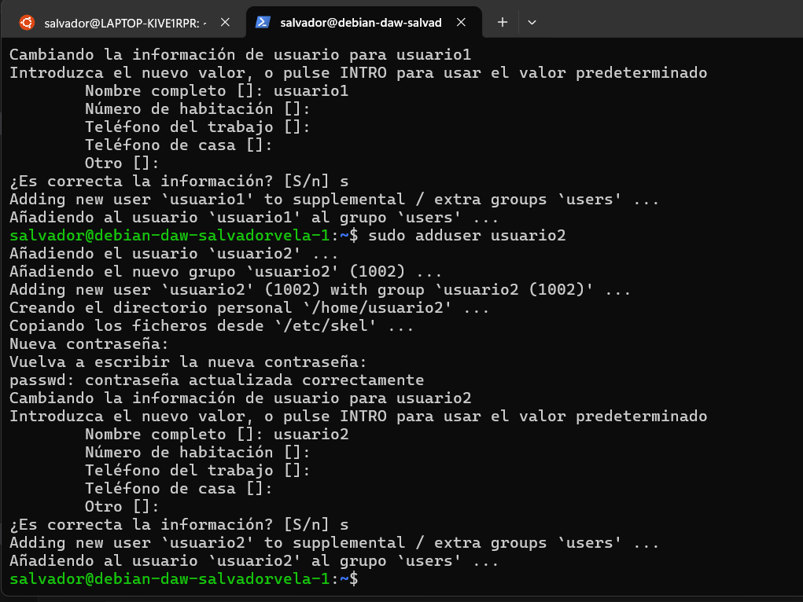

## Creación de Directorios `public_html`

Después de esto, procedemos a crear las carpetas `public_html` en cada usuario. Para esto usaremos estos comandos:
```bash
sudo mkdir /home/usuario1/public_html
sudo mkdir /home/usuario2/public_html
```

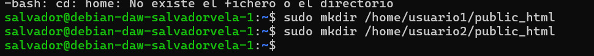

Una vez hecho esto, le damos los permisos correspondientes. Para hacer esto usamos estos comandos:
```bash
sudo chmod 755 /home/usuario1/public_html
sudo chmod 755 /home/usuario2/public_html
```

Después, le cambiamos la propiedad de los directorios a sus respectivos usuarios con estos comandos:
```bash
sudo chown -R www-data:www-data /home/usuario1/public_html
sudo chown -R www-data:www-data /home/usuario2/public_html
```

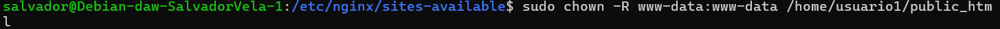

## Creación del Contenido Web

Ahora que ya hemos dado los permisos, ya podemos empezar con la creación del contenido web.

Para esto necesitamos crear en cada carpeta `public_html` de cada usuario un archivo `index.html` con un contenido para que se muestre.

Podemos usar este como ejemplo para el usuario1:
```html
<!DOCTYPE html>
<html>
<head>
     <title>Usuario 1</title>
</head>
<body>
     <h1>Bienvenido al sitio de Usuario 1</h1>
</body>
</html>
```

Para el usuario2 podemos usar el mismo pero cambiándole el 1 por el 2.

Para hacer esto, crearemos los `index.html` y le añadiremos el contenido de ejemplo con:
```bash
sudo nano /home/usuario1/public_html/index.html
sudo nano /home/usuario2/public_html/index.html
```

y le introducimos el HTML.

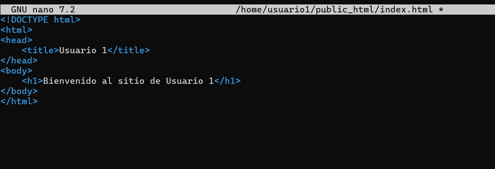

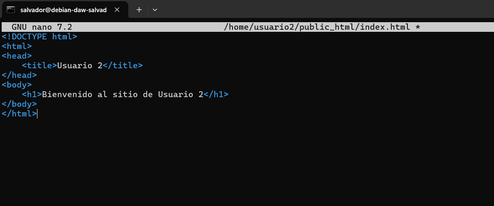

## Configuración de Nginx

Una vez tenemos esto, ya podemos empezar con la configuración de Nginx.

Para empezar, nos vamos a dirigir a `/etc/nginx/sites-available/` y crearemos los archivos de configuración para cada usuario.

Como tenemos que hacer uno para cada usuario, voy a llamarlos `usuario1conf` y `usuario2conf`.

Estos los crearemos usando `nano`, su contenido será este:
```nginx
server {
     listen 80;
     server_name usuario1.local;

     root /home/usuario1/public_html;
     index index.html;

     location / {
          try_files $uri $uri/ =404;
     }
}
```

En el se indica el puerto y la ruta que se deberá de cambiar para el usuario 2.

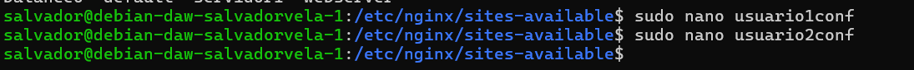

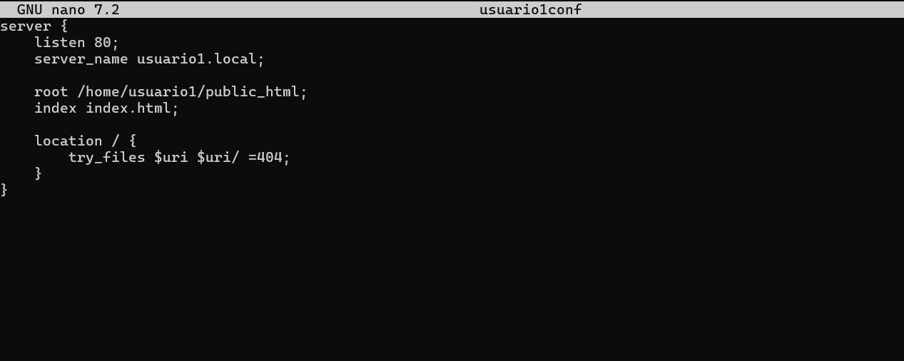

Ahora necesitamos habilitar los sitios web. Para ello necesitamos crear un enlace simbólico para cada uno en `/etc/nginx/sites-enabled/`.

Los crearemos con estos comandos:
```bash
sudo ln -s /etc/nginx/sites-available/usuario1conf /etc/nginx/sites-enabled/
sudo ln -s /etc/nginx/sites-available/usuario2conf /etc/nginx/sites-enabled/
```

Una vez hecho esto, al meternos en `sites-enabled` debería verse así:

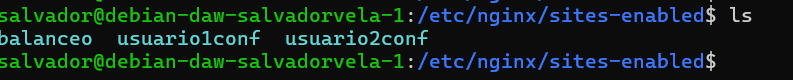

Debe salir del mismo color que se muestra en la foto. Si no aparece de la misma forma, es porque ha habido algún error.

Una vez hecho esto, ponemos el siguiente comando para ver si tenemos algún error:
```bash
sudo nginx -t
```

Y si todo sale bien, ponemos:
```bash
sudo systemctl reload nginx
```
para reiniciar Nginx.

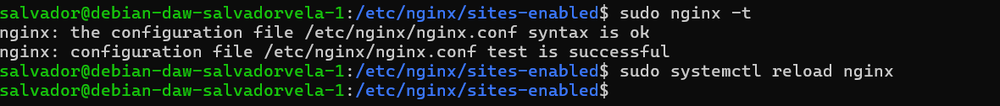

## Configuración del Archivo `hosts`

Una vez hecho esto, tenemos que abrir el archivo `hosts` de nuestra máquina física y poner lo siguiente:


Para que funcione, deberéis de poner la IP de vuestra máquina virtual y el nombre del dominio que habéis puesto en los archivos de configuración:
```
http://usuario1.local
http://usuario2.local
```

Una vez hecho esto, al acceder a las URL debería de aparecer el contenido de los HTML de prueba que metimos en el directorio de `public_html`.


## Configuración HTTPS

Ahora, para terminar, lo que necesitamos es añadir la configuración HTTPS. Para ello, primero debemos generar los certificados SSL autofirmados para cada dominio:
```bash
sudo openssl req -x509 -nodes -days 365 -newkey rsa:2048 -keyout /etc/ssl/private/usuario1.key -out /etc/ssl/certs/usuario1.crt
sudo openssl req -x509 -nodes -days 365 -newkey rsa:2048 -keyout /etc/ssl/private/usuario2.key -out /etc/ssl/certs/usuario2.crt
```

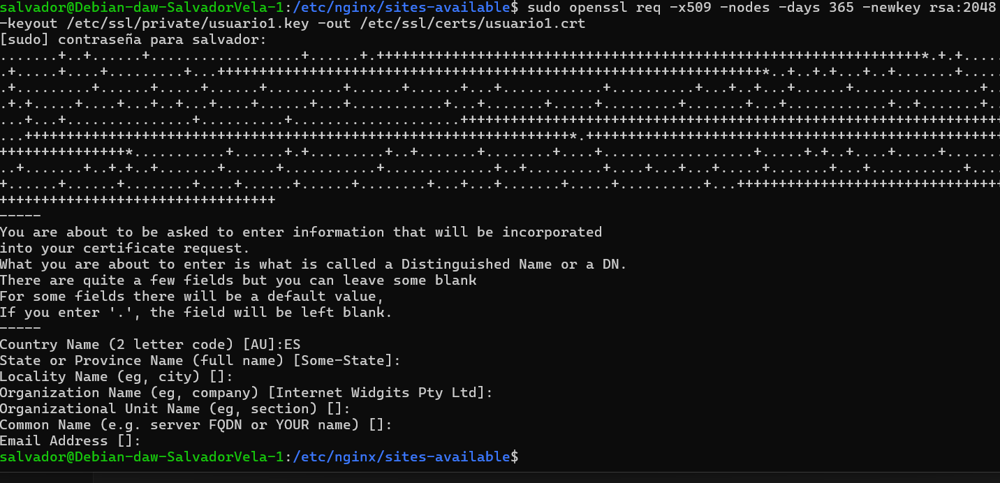

El siguiente paso es modificar los archivos de configuración para que incluya el HTTPS.

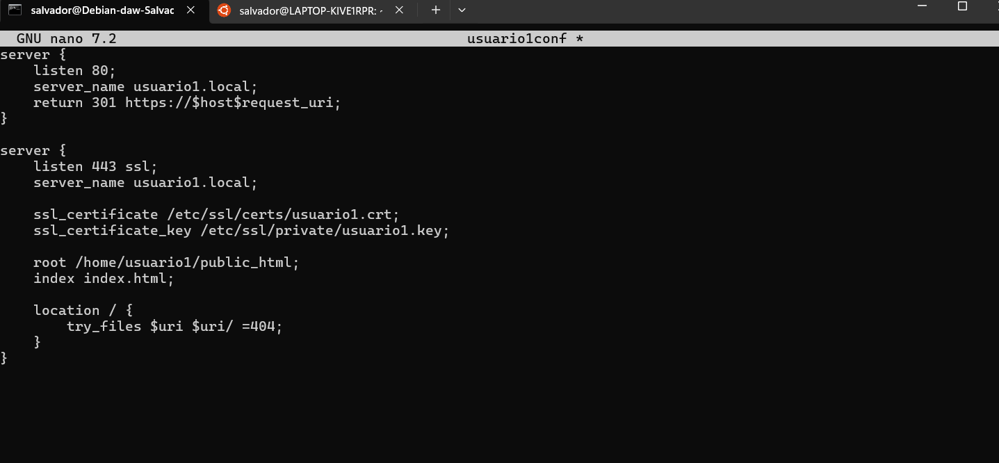

Después de modificar los archivos, volvemos a reiniciar Nginx con:
```bash
sudo systemctl reload nginx
```
y ya debería de aparecer el certificado.

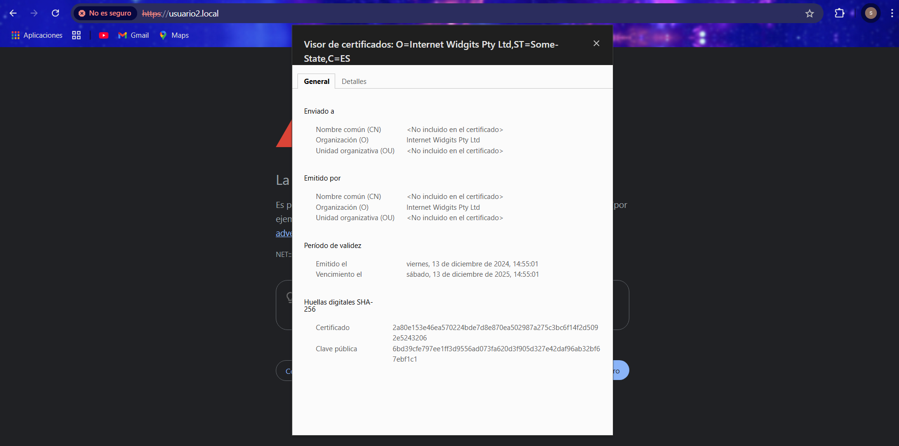
