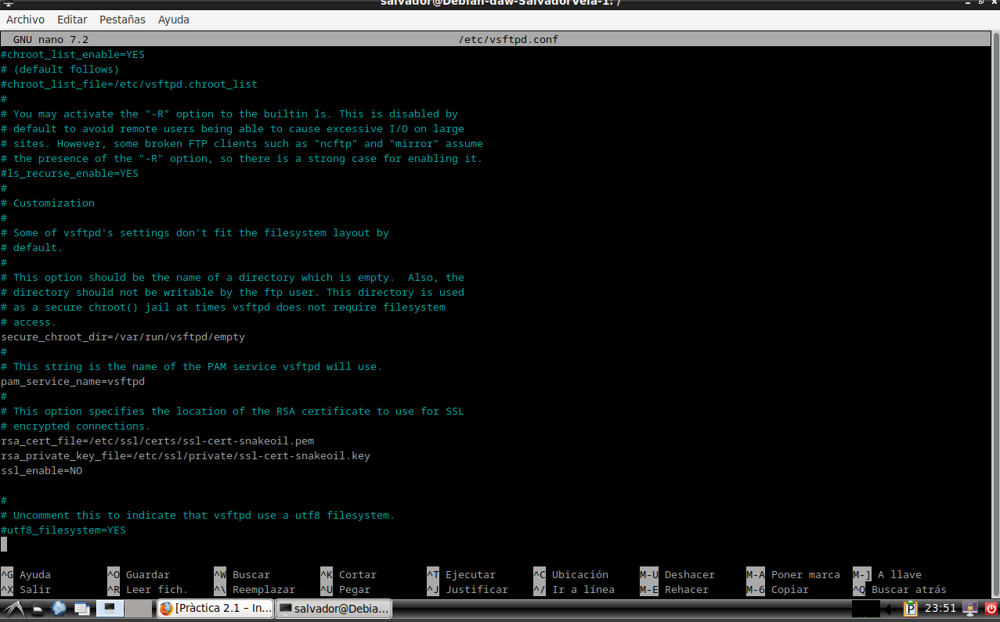

# Práctica 2.1 – Instalación y configuración de servidor web Nginx

## Instalación servidor web Nginx

Para instalar el servidor Nginx en nuestra Debian, primero actualizamos los repositorios y después instalamos el paquete correspondiente:


Comprobamos que Nginx se ha instalado y que está funcionando correctamente:


## Creación de la carpeta del sitio web

Una vez hecho esto vamos a crear la carpeta de nuestro sitio web o dominio:


Dentro de esa carpeta `html`, debéis clonar el siguiente repositorio:

[https://github.com/cloudacademy/static-website-example](https://github.com/cloudacademy/static-website-example)


Además, haremos que el propietario de esta carpeta y todo lo que haya dentro sea el usuario `www-data`, típicamente el usuario del servicio web.


Y le daremos los permisos adecuados para que no nos dé un error de acceso no autorizado al entrar en el sitio web:


Para comprobar que el servidor está funcionando y sirviendo páginas correctamente, podéis acceder desde vuestro cliente a:

`http://IP-maq-virtual`


En Nginx hay dos rutas importantes. La primera de ellas es `sites-available`, que contiene los archivos de configuración de los hosts virtuales o bloques disponibles en el servidor. Es decir, cada uno de los sitios webs que alberga el servidor. La otra es `sites-enabled`, que contiene los archivos de configuración de los sitios habilitados, es decir, los que funcionan en ese momento.

Dentro de `sites-available` hay un archivo de configuración por defecto (`default`), que es la página que se muestra si accedemos al servidor sin indicar ningún sitio web o cuando el sitio web no es encontrado en el servidor (debido a una mala configuración, por ejemplo). Esta es la página que nos ha aparecido en el apartado anterior.

Para que Nginx presente el contenido de nuestra web, es necesario crear un bloque de servidor con las directivas correctas. En vez de modificar el archivo de configuración predeterminado directamente, crearemos uno nuevo en `/etc/nginx/sites-available/nombre_web`:


Y el contenido de este nuevo archivo es:


Aquí la directiva `root` debe ir seguida de la ruta absoluta donde se encuentre el archivo `index.html` de nuestra página web, que se encuentra entre todos los que habéis descomprimido.

Y crearemos un archivo simbólico entre este archivo y el de sitios que están habilitados, para que se dé de alta automáticamente.


Y reiniciamos el servidor para aplicar la configuración:


## Comprobaciones

### Comprobación del correcto funcionamiento

Como aún no poseemos un servidor DNS que traduzca los nombres a IPs, debemos hacerlo de forma manual. Vamos a editar el archivo `/etc/hosts` de nuestra máquina anfitriona para que asocie la IP de la máquina virtual a nuestro `server_name`.

Este archivo, en Linux, está en: `/etc/hosts`

Y en Windows: `C:\Windows\System32\drivers\etc\hosts`

En mi caso usare windows


Y deberemos añadirle la línea:

`192.168.X.X nombre_web`


Donde debéis sustituir la IP por la que tenga vuestra máquina virtual.

### Comprobar registros del servidor

Comprobad que las peticiones se están registrando correctamente en los archivos de logs, tanto las correctas como las erróneas:

- `/var/log/nginx/access.log`: cada solicitud a su servidor web se registra en este archivo de registro, a menos que Nginx esté configurado para hacer algo diferente.
- `/var/log/nginx/error.log`: cualquier error de Nginx se asentará en este registro.

Aqui se muestra el contenido que contine mi `/var/log/nginx/access.log`


Si queremos tener varios dominios o sitios web en el mismo servidor Nginx (es decir, que tendrán la misma IP), debemos repetir todo el proceso anterior con el nuevo nombre de dominio que queramos configurar.


### Configurar servidor SFTP en Debian

En primer lugar, lo instalaremos desde los repositorios:

```bash
sudo apt-get update
sudo apt-get install vsftpd

```


Ahora vamos a crear una carpeta en nuestro home en Debian:

```bash
mkdir /home/nombre_usuario/ftp
```


En la configuración de vsftpd indicaremos que este será el directorio al cual vsftpd se cambia después de conectarse el usuario.

Ahora vamos a crear los certificados de seguridad necesarios para aportar la capa de cifrado a nuestra conexión (algo parecido a HTTPS):

```bash
sudo openssl req -x509 -nodes -days 365 -newkey rsa:2048 -keyout /etc/ssl/private/vsftpd.pem -out /etc/ssl/private/vsftpd.pem
```


Y una vez realizados estos pasos, procedemos a realizar la configuración de vsftpd propiamente dicha. Se trata, con el editor de texto que más os guste, de editar el archivo de configuración de este servicio, por ejemplo con nano:

```bash
sudo nano /etc/vsftpd.conf
```


En primer lugar, buscaremos las siguientes líneas del archivo y las eliminaremos por completo:

```
rsa_cert_file=/etc/ssl/certs/ssl-cert-snakeoil.pem
rsa_private_key_file=/etc/ssl/private/ssl-cert-snakeoil.key
ssl_enable=NO
```



Tras ello, añadiremos estas líneas en su lugar:

```
rsa_cert_file=/etc/ssl/private/vsftpd.pem
rsa_private_key_file=/etc/ssl/private/vsftpd.pem
ssl_enable=YES
allow_anon_ssl=NO
force_local_data_ssl=YES
force_local_logins_ssl=YES
ssl_tlsv1=YES
ssl_sslv2=NO
ssl_sslv3=NO
require_ssl_reuse=NO
ssl_ciphers=HIGH

local_root=/home/nombre_usuario/ftp
```


Y, tras guardar los cambios, reiniciamos el servicio para que coja la nueva configuración:

```bash
sudo systemctl restart --now vsftpd
```


Tras acabar esta configuración, ya podremos acceder a nuestro servidor mediante un cliente FTP adecuado, como por ejemplo Filezilla de dos formas, a saber:

1. Mediante el puerto por defecto del protocolo inseguro FTP, el 21, pero utilizando certificados que cifran el intercambio de datos convirtiéndolo así en seguro.
2. Haciendo uso del protocolo SFTP, dedicado al intercambio de datos mediante una conexión similar a SSH, utilizando de hecho el puerto 22.


Recordemos que debemos tener nuestro sitio web en la carpeta `/var/www` y darle los permisos adecuados, de forma similar a cómo hemos hecho con el otro sitio web.

El comando que nos permite descomprimir un .zip en un directorio concreto es:

```bash
unzip archivo.zip -d /nombre/directorio
```

Si no tuvierais `unzip` instalado, lo instaláis:

```bash
sudo apt-get update && sudo apt-get install unzip
```

## Para configurar HTTPS en tu servidor web y redirigir automáticamente todas las solicitudes HTTP a HTTPS:

- **Generar Certificados SSL Autofirmados**  
  Para generar certificados SSL autofirmados, usa el siguiente comando:

  ```bash
  sudo openssl req -x509 -nodes -days 365 -newkey rsa:2048 -keyout /etc/ssl/private/nginx-selfsigned.key -out /etc/ssl/certs/nginx-selfsigned.crt
  ```

  

- **Configurar Nginx para Usar el Certificado SSL**  
  Edita el archivo de configuración del sitio web en Nginx. Esto podría estar en `/etc/nginx/sites-available/nombre_web` o `/etc/nginx/conf.d/nombre_web.conf` dependiendo de tu configuración.

  ```bash
  sudo nano /etc/nginx/sites-available/nombre_web
  ```

  Agrega o modifica las secciones de configuración como sigue:

  

  

- **Revisar la Configuración de Nginx**  
  Después de hacer los cambios, revisa la configuración de Nginx para asegurarte de que no haya errores:

  ```bash
  sudo nginx -t
  ```

  Si la configuración es correcta, verás un mensaje de éxito.

- **Reiniciar Nginx**  
  Reinicia el servidor Nginx para aplicar los cambios:

  ```bash
  sudo systemctl restart nginx
  ```

  

- **Comprobar la Redirección y HTTPS**  
  Abre tu navegador y visita `http://servidor1` (o la dirección IP o dominio que estés utilizando). Deberías ser redirigido automáticamente a `https://servidor1`.  
  Comprueba que el certificado se carga correctamente y que el sitio está utilizando HTTPS.

  
